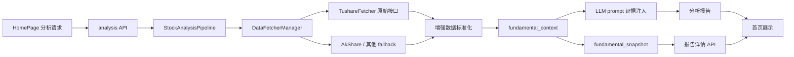

# 首页个股分析 Tushare 6000 积分增强技术设计

## 1. 文档信息

- 文档类型：技术设计
- 当前状态：Draft
- 最近更新：2026-05-07
- 产品文档：[首页个股分析 Tushare 6000 积分增强产品文档](home-stock-analysis-tushare-enhancement-product-design.md)
- SPEC：[首页个股分析 Tushare 6000 积分增强 SPEC](home-stock-analysis-tushare-enhancement-spec.md)
- 适用范围：首页个股分析的 A 股单票分析链路

## 2. 设计目标

本设计把 Tushare 6000 积分能力接入首页个股分析，但不改变首页提交入口和主 API 契约。

目标：

1. 在 A 股分析中补齐基本面、资金流、板块联动、筹码结构四类结构化证据。
2. 把增强数据接入现有 `StockAnalysisPipeline -> DataFetcherManager -> LLM 分析 -> context snapshot -> 报告详情` 链路。
3. 第一阶段优先增强后端上下文和报告质量，前端只复用已有详情字段。
4. 保持 fail-open，任何单一 Tushare 接口失败都不能拖垮整次个股分析。
5. 记录数据源、接口、日期、状态、错误和降级原因，便于排查和回放。

非目标：

- 不新增一套平行首页或平行分析 API。
- 不把 Tushare 作为唯一数据源。
- 不对港股、美股强行套用 A 股专属字段。
- 不把资金流、筹码或板块信号包装成自动交易决策。

## 3. 当前实现基线

### 3.1 前端和 API

- 首页入口：`apps/dsa-web/src/pages/HomePage.tsx`
- 分析请求：`apps/dsa-web/src/api/analysis.ts`
- 首页状态流：`apps/dsa-web/src/stores/stockPoolStore.ts`
- 报告类型：`apps/dsa-web/src/types/analysis.ts`
- 分析 API：`api/v1/endpoints/analysis.py`
- 历史 API：`api/v1/endpoints/history.py`

当前前端已经能展示报告摘要、Markdown 正文和部分报告详情字段。第一阶段不要求新增首页操作入口。

### 3.2 后端主链路

当前个股分析主链路在 `src/core/pipeline.py`：

1. 获取实时行情。
2. 获取筹码分布。
3. 调用 `DataFetcherManager.get_fundamental_context()` 聚合基本面上下文。
4. 附加 `belong_boards`。
5. 保存 `fundamental_snapshot`。
6. 做趋势、新闻、LLM 分析。
7. 报告详情 API 从保存结果和 snapshot 中提取结构化字段。

### 3.3 数据源现状

- `data_provider/base.py`
  - 已有 `get_fundamental_context()`。
  - 已有 `get_capital_flow_context()`。
  - 已有 `get_board_context()`。
  - 已有 `get_chip_distribution()`。
  - 已有 `get_belong_boards()` 和 `get_sector_rankings()`。
- `data_provider/fundamental_adapter.py`
  - 当前主要基于 AkShare 聚合财务摘要、业绩、分红、机构和股东等信息。
- `data_provider/tushare_fetcher.py`
  - 已有 `get_stock_moneyflow_ths()`。
  - 已有 `get_stock_moneyflow_dc()`。
  - 已有 `get_ths_index()`。
  - 已有 `get_ths_members()`。
  - 已有 `get_cyq_perf()`。
  - 已有 `get_cyq_chips()`。
  - 已有基于 `cyq_chips` 的 `get_chip_distribution()`。

## 4. 总体架构



设计原则：

- 统一入口仍是 `DataFetcherManager`，不要让 Pipeline 或前端直接调用 Tushare。
- Provider 层只做抓取和标准化，不生成投资结论。
- Pipeline 层只组合证据和保存快照，不吞掉完整错误信息。
- Analyzer / Prompt 层负责把证据转成可读结论，但不能臆造缺失数据。

## 5. 数据源能力映射

| 增强方向 | Tushare 接口 | 当前代码状态 | 技术动作 |
| --- | --- | --- | --- |
| 每日估值、换手、股息率 | `daily_basic` | 强势筛选链路中已有使用，首页基本面链路未统一接入 | 增加单票 normalized 方法并接入 `valuation` block |
| 财务指标 | `fina_indicator` | 首页基本面当前主要走 AkShare adapter | 新增 Tushare 财务指标摘要方法，接入 `profitability` / `growth` / `earnings` |
| 分红 | `dividend` | AkShare adapter 已有分红归一化 | 增加 Tushare 分红摘要，优先补 `dividend_metrics`，失败回退 AkShare |
| 业绩预告/快报 | `forecast`、`express` | AkShare adapter 已有业绩摘要 | 增加 Tushare 事件摘要，按公告日期排序 |
| 个股资金流 | `moneyflow_ths`、`moneyflow_dc` | `TushareFetcher` 已有方法 | 在 `get_capital_flow_context()` 中优先聚合 THS/DC 并输出冲突信号 |
| 同花顺板块 | `ths_index`、`ths_member` | `TushareFetcher` 已有方法 | 增强 `get_board_context()` 与 `belong_boards`，补板块归属和强弱解释 |
| 筹码结构 | `cyq_perf`、`cyq_chips` | `TushareFetcher` 已有方法，`get_chip_distribution()` 已可计算常用指标 | 补 `chip_metrics` 和 `chip_signal`，并纳入 LLM 证据 |

## 6. 标准数据模型

### 6.1 Block 统一结构

所有增强数据 block 都使用同一套元信息结构：

```json
{
  "status": "complete",
  "source": "tushare",
  "api": "daily_basic",
  "as_of": "20260507",
  "updated_at": "2026-05-07T17:10:00+08:00",
  "data": {},
  "warnings": [],
  "errors": [],
  "source_chain": [
    {
      "provider": "tushare.daily_basic",
      "result": "complete",
      "duration_ms": 320
    }
  ]
}
```

状态枚举：

- `complete`：数据完整且日期可解释。
- `partial`：接口成功但字段不完整。
- `fallback`：Tushare 不可用，使用 AkShare 或其他数据源。
- `missing`：无可用数据。
- `stale`：数据日期落后于最近交易日。
- `permission_denied`：疑似权限或积分不足。
- `error`：接口异常或解析失败。
- `not_supported`：非 A 股、ETF 或该数据不适用。

### 6.2 `fundamental_context` 目标结构

`fundamental_context` 继续作为首页分析的统一上下文载体，新增或强化以下 block：

```json
{
  "market": "cn",
  "enhanced_by_tushare": true,
  "coverage": {
    "valuation": "complete",
    "profitability": "complete",
    "growth": "partial",
    "earnings": "complete",
    "capital_flow": "complete",
    "boards": "partial",
    "chip": "complete"
  },
  "valuation": {},
  "profitability": {},
  "growth": {},
  "earnings": {},
  "capital_flow": {},
  "boards": {},
  "chip": {},
  "source_chain": [],
  "errors": []
}
```

兼容要求：

- 保留现有 `valuation`、`growth`、`earnings`、`institution`、`capital_flow`、`dragon_tiger`、`boards` 语义。
- 新增 `profitability` 和 `chip` 时必须可选。
- 已有调用方找不到新字段时不受影响。

## 7. Provider 层设计

### 7.1 Tushare 原始方法补齐

建议在 `data_provider/tushare_fetcher.py` 中补齐首页单票需要的原始方法，统一返回 JSON-safe payload，不返回裸 DataFrame 给上层。

建议方法：

```python
def get_daily_basic_metrics(self, ts_code: str, trade_date: str | None = None, lookback_days: int = 10) -> dict:
    ...

def get_financial_indicator_summary(self, ts_code: str, periods: int = 4) -> dict:
    ...

def get_dividend_summary(self, ts_code: str, years: int = 5) -> dict:
    ...

def get_performance_event_summary(self, ts_code: str, periods: int = 4) -> dict:
    ...

def get_tushare_fundamental_bundle(self, stock_code: str) -> dict:
    ...
```

字段映射：

| 目标字段 | 来源 |
| --- | --- |
| `pe`、`pe_ttm`、`pb`、`ps_ttm`、`dv_ttm`、`total_mv`、`circ_mv` | `daily_basic` |
| `roe`、`roe_dt`、`grossprofit_margin`、`netprofit_margin`、`roa`、`roic` | `fina_indicator` |
| `revenue_yoy`、`netprofit_yoy`、`dt_netprofit_yoy`、`eps`、`ocfps` | `fina_indicator` |
| `cash_dividend_per_share`、`ttm_cash_dividend_per_share`、`ttm_dividend_yield_pct` | `dividend` + latest price |
| `forecast_summary`、`quick_report_summary`、`ann_date`、`report_period` | `forecast`、`express` |

### 7.2 标准化注意事项

- A 股代码统一转为 Tushare `ts_code`。
- 日期统一保留原始 `trade_date` / `ann_date` / `end_date`，对外展示再转换。
- 金额单位必须写入字段名或元信息，避免万元、亿元、市值单位混用。
- pandas 的 `NaN`、`Timestamp`、`numpy` 标量必须转成 JSON-safe 类型。
- Tushare 错误需要区分权限、空数据、超时、网络错误和解析错误。

## 8. DataFetcherManager 聚合设计

### 8.1 基本面聚合

改造位置：`data_provider/base.py::get_fundamental_context()`。

当前逻辑：

1. 用实时行情填 `valuation`。
2. 用 AkShare adapter 填 `growth`、`earnings`、`institution`。
3. 再聚合资金流、龙虎榜、板块。

目标逻辑：

1. A 股且 `TUSHARE_TOKEN` 可用时，优先调用 Tushare fundamental bundle。
2. Tushare 成功字段优先进入 `valuation`、`profitability`、`growth`、`earnings`。
3. AkShare adapter 作为 fallback，补 Tushare 缺失字段。
4. 实时行情仍可补最新价格和 `pe_ratio` / `pb_ratio` 兼容字段。
5. 合并结果统一产出 coverage、source_chain、errors。

建议合并策略：

```text
字段级优先级：
Tushare complete > Tushare partial non-empty > AkShare non-empty > realtime_quote fallback

状态合并：
有 Tushare 成功字段：complete / partial
Tushare 失败但 fallback 成功：fallback
均失败：missing / error
```

### 8.2 资金流聚合

改造位置：`data_provider/base.py::get_capital_flow_context()`。

目标：

- 优先取 `moneyflow_ths` 和 `moneyflow_dc`。
- 分别保留 THS/DC 原始摘要。
- 计算统一信号：
  - `inflow_confirmed`：THS/DC 同为净流入。
  - `outflow_confirmed`：THS/DC 同为净流出。
  - `mixed_signal`：THS/DC 方向冲突。
  - `missing`：均不可用。
- 生成近 3/5/10 日净流入方向。

目标输出：

```json
{
  "status": "complete",
  "data": {
    "ths": {},
    "dc": {},
    "net_d3_amount": 1234.5,
    "net_d5_amount": 4567.8,
    "signal": "inflow_confirmed",
    "mixed_reason": null
  }
}
```

### 8.3 板块聚合

改造位置：

- `data_provider/base.py::get_board_context()`
- `data_provider/base.py::get_belong_boards()`
- `src/core/pipeline.py::_attach_belong_boards_to_fundamental_context()`

目标：

- 用 `ths_member` 建立个股到同花顺板块的归属。
- 用 `ths_index` 补板块名称、类型、市场、更新状态。
- 用已有 sector rankings 计算所属板块强弱。
- 输出个股相对板块状态：`leading`、`aligned`、`lagging`、`isolated`。

排序建议：

1. 板块强度或资金排名靠前。
2. 个股所属关系明确。
3. 数据日期更新。
4. 板块类型优先级：行业 > 概念 > 主题 > 特色。

### 8.4 筹码聚合

改造位置：

- `data_provider/tushare_fetcher.py::get_chip_distribution()`
- `data_provider/base.py::get_chip_distribution()`
- `src/core/pipeline.py` 筹码注入和 prompt 上下文。

目标：

- `cyq_perf` 成功时输出胜率、加权平均成本、成本分位。
- `cyq_chips` 成功时输出筹码分布、密集区和上方套牢区。
- 两者任一成功都应产出 `chip` block。
- 根据当前价和成本分位生成轻量 `chip_signal`：
  - `supportive`
  - `neutral`
  - `overheated`
  - `pressure_heavy`

信号只做解释辅助，不直接给买卖动作。

## 9. Pipeline 和 Prompt 接入

### 9.1 Pipeline

改造位置：`src/core/pipeline.py`。

当前 Pipeline 已经调用：

- `get_chip_distribution(code)`
- `get_fundamental_context(code)`
- `_attach_belong_boards_to_fundamental_context(code, context)`
- `save_fundamental_snapshot(...)`

第一阶段主要要求：

- 确保增强后的 `fundamental_context` 原样进入 snapshot。
- 确保 LLM 分析拿到增强上下文。
- 如果 Tushare 增强失败，Pipeline 只记录 warning，不抛出到主流程。
- `query_id`、`source_chain`、`coverage` 保持可追踪。

### 9.2 Analyzer / Prompt

改造位置：`src/analyzer.py`。

Prompt 约束：

- 基本面必须区分 `trade_date`、`report_period`、`ann_date`。
- 资金流必须说明 THS/DC 是否一致。
- 板块联动必须说明领先、跟随、落后或孤立。
- 筹码结构必须说明支撑、压力、套牢区和追涨风险。
- 数据缺失时输出“未能确认”，禁止补写不存在的数值。
- Phase 3 追加 `dashboard.data_perspective.enhanced_evidence`，输出短线和中线证据权重、证据链、冲突证据和数据缺口。
- Phase 3 追加 `dashboard.battle_plan.timeframe_strategy`，固定输出短线策略、中线策略、冲突处理和操作边界，并要求与止损位一致。
- 当 `fundamental_context` 中已有增强数据进入 prompt 时，报告完整性校验会把上述 Phase 3 字段纳入补全重试；普通旧报告或无增强上下文的报告不强制要求这些可选字段。

建议新增内部段落：

```text
【增强数据证据】
1. 基本面：估值、盈利能力、成长性、分红和财报事件。
2. 资金流：THS/DC 主力净流入和多日趋势。
3. 板块联动：所属板块、板块排名、相对强弱。
4. 筹码结构：胜率、成本分位、密集区、压力区。
5. 数据质量：缺失、过期、fallback 和权限问题。
```

## 10. API 和前端兼容

### 10.1 第一阶段 API

第一阶段优先复用已有字段：

- `financial_report`
- `dividend_metrics`
- `belong_boards`
- `sector_rankings`

改造位置：

- `src/utils/data_processing.py`
- `api/v1/endpoints/analysis.py`
- `api/v1/endpoints/history.py`
- `api/v1/schemas/history.py`
- `apps/dsa-web/src/types/analysis.ts`

### 10.2 可选新增字段

后续可追加：

- `capital_flow_metrics`
- `chip_metrics`
- `data_quality`
- `tushare_enhancement`

兼容规则：

- API 只追加可选字段，不删除旧字段。
- 前端类型使用 optional / nullable。
- 旧报告没有新字段时不展示空卡片。

### 10.3 前端展示顺序

Phase 1：

- 不改首页主 UI。
- 依赖 Markdown 报告正文表达增强证据。
- 详情页继续展示已有字段。

Phase 2：

- 增加数据质量摘要。
- 增加基本面和分红轻量卡片。
- 增加资金流和筹码折叠区。
- 板块联动补“领先/落后/孤立”解释。

## 11. 缓存和频控

第一阶段尽量复用现有配置，不新增 `.env` 项。

已有相关配置：

- `ENABLE_FUNDAMENTAL_PIPELINE`
- `FUNDAMENTAL_STAGE_TIMEOUT_SECONDS`
- `FUNDAMENTAL_FETCH_TIMEOUT_SECONDS`
- `FUNDAMENTAL_CACHE_TTL_SECONDS`
- `FUNDAMENTAL_CACHE_MAX_ENTRIES`
- `TUSHARE_TOKEN`

缓存建议：

| 数据 | 缓存键 | TTL 建议 |
| --- | --- | --- |
| `daily_basic` | `ts_code + trade_date` | 1 个交易日 |
| `fina_indicator` | `ts_code + report_period` | 7 到 30 天 |
| `dividend` | `ts_code + ann_date/end_date` | 30 天 |
| `forecast` / `express` | `ts_code + ann_date` | 7 天 |
| `moneyflow_ths` / `moneyflow_dc` | `ts_code + trade_date` | 1 个交易日 |
| `ths_index` | `ts_code/type` | 7 天 |
| `ths_member` | `ts_code/theme_code` | 7 天 |
| `cyq_perf` / `cyq_chips` | `ts_code + trade_date` | 1 个交易日 |

频控建议：

- 单票首页分析按接口串行或小并发执行，避免触达 Tushare 频率限制。
- 批量任务中先用缓存，再触发网络请求。
- 对资金流和筹码这类盘后数据，优先使用最近交易日缓存。

## 12. 错误处理

| 场景 | 行为 |
| --- | --- |
| 未配置 `TUSHARE_TOKEN` | 跳过 Tushare，走现有 fallback |
| 权限不足 | block 标记 `permission_denied`，记录接口名 |
| 接口超时 | block 标记 `error` 或 `partial`，保留成功字段 |
| 返回空表 | block 标记 `missing` |
| 字段缺失 | block 标记 `partial`，不补假值 |
| 数据日期过旧 | block 标记 `stale`，Prompt 降低信号强度 |
| 非 A 股 | block 标记 `not_supported`，保留港股/美股原链路 |
| JSON 序列化失败 | Provider 层转 JSON-safe，失败时记录错误并丢弃问题字段 |

日志要求：

- 不输出 token。
- 不输出完整 `.env`。
- 网络错误和权限错误保留接口名、参数日期、耗时和 provider。

## 13. 观测和排障

需要能从以下位置定位增强数据状态：

- 应用日志：接口成功、失败、耗时、fallback。
- `fundamental_snapshot`：完整 `fundamental_context`、coverage、source_chain。
- 报告详情 API：已有详情字段和后续新增 data_quality。

建议在日志中增加统一前缀：

```text
[home_tushare_enhancement] stock=600519 block=capital_flow status=complete source=tushare.moneyflow_ths duration_ms=...
```

## 14. 测试设计

### 14.1 单元测试

新增或扩展：

- `tests/test_tushare_fundamental_adapter.py`
- `tests/test_data_fetcher_fundamental_context.py`
- `tests/test_data_processing.py`
- `tests/test_market_board_context.py`
- `tests/test_chip_distribution.py`

覆盖：

- Tushare 成功返回。
- Tushare 空表。
- 权限不足。
- 超时。
- NaN / Timestamp / numpy 标量序列化。
- Tushare 部分字段 + AkShare fallback 合并。
- 非 A 股跳过增强。

### 14.2 API 测试

覆盖：

- `/api/v1/analysis/analyze` 生成的报告详情兼容旧字段。
- 历史报告详情缺少新增字段时仍可返回。
- 新增可选字段不破坏前端类型。

### 14.3 手工验证

验证矩阵：

| 场景 | 预期 |
| --- | --- |
| 无 Tushare token | 首页分析完成，coverage 显示 fallback / not_supported |
| 6000 积分 token | A 股报告包含基本面、资金流、板块、筹码证据 |
| 权限不足 token | 报告完成，block 标记 `permission_denied` |
| 网络超时 | 报告完成，成功 block 保留，失败 block 降级 |
| 非 A 股 | 不触发 A 股专属增强 |
| 盘前/盘中/盘后 | 数据日期正确，过旧数据标记 `stale` |

## 15. 开发拆分

### Step 1：Tushare 基本面 normalized 方法

文件：

- `data_provider/tushare_fetcher.py`
- 可选新增 `data_provider/tushare_fundamental_adapter.py`

产出：

- `daily_basic` 单票摘要。
- `fina_indicator` 最新多期摘要。
- `dividend` 分红摘要。
- `forecast` / `express` 业绩事件摘要。
- JSON-safe payload。

### Step 2：DataFetcherManager 聚合接线

文件：

- `data_provider/base.py`

产出：

- Tushare 优先、AkShare fallback 的基本面合并。
- 资金流 THS/DC 聚合。
- 板块 THS 归属增强。
- coverage/source_chain/errors 统一。

### Step 3：Pipeline 与 Prompt

文件：

- `src/core/pipeline.py`
- `src/analyzer.py`
- `src/schemas/report_schema.py`

产出：

- 增强 context 进入 snapshot。
- Prompt 增加证据约束。
- 报告输出基本面、资金流、板块、筹码和数据缺口。
- 报告 JSON 结构新增可选 `enhanced_evidence` 和 `timeframe_strategy`，用于承载短线/中线证据权重与“结论 -> 证据 -> 风险 -> 操作边界”链路。
- 完整性重试链路在增强上下文存在时校验 `enhanced_evidence` 和 `timeframe_strategy`，缺失时要求 LLM 基于上一版 JSON 补齐。

### Step 4：API 详情字段

文件：

- `src/utils/data_processing.py`
- `api/v1/endpoints/analysis.py`
- `api/v1/endpoints/history.py`
- `api/v1/schemas/history.py`

产出：

- Phase 1 复用旧字段。
- Phase 2 可选新增 `capital_flow_metrics`、`chip_metrics`、`data_quality`。

### Step 5：前端轻量展示

文件：

- `apps/dsa-web/src/types/analysis.ts`
- 报告详情相关组件。

产出：

- 旧报告兼容。
- 空字段不渲染空卡片。
- 数据质量、资金流、筹码结构可折叠展示。

## 16. 上线方案

推荐顺序：

1. 先合入 Provider normalized 方法和单元测试。
2. 再接入 `get_fundamental_context()`，默认 fail-open。
3. 开启 snapshot 观察，不改前端主界面。
4. 用 3 到 5 只 A 股手工验证报告质量。
5. 再补 API 可选字段和前端轻量展示。

上线前检查：

- 无 token 环境可运行。
- token 权限不足可运行。
- 非 A 股可运行。
- 单接口超时可运行。
- `fundamental_snapshot` 不含敏感配置。

## 17. 回滚方案

- Provider 问题：关闭 Tushare enhanced block，保留 AkShare adapter。
- 聚合问题：回退 `get_fundamental_context()` 的 Tushare 优先逻辑。
- Prompt 问题：回退 prompt 增强，保留 snapshot。
- API 问题：停止返回新增可选字段，保留旧字段。
- 频控问题：提高缓存 TTL，盘后再启用资金流和筹码增强。

## 18. 验收标准

1. 首页分析请求和主 API 参数不变。
2. A 股 + 可用 Tushare token 时，报告上下文至少命中基本面、资金流、板块、筹码四类中的三类。
3. 任一 Tushare 接口失败不阻断报告生成。
4. `financial_report`、`dividend_metrics`、`belong_boards`、`sector_rankings` 继续可用。
5. context snapshot 能追踪每个 block 的来源、日期、状态和降级原因。
6. 旧报告、非 A 股报告和无 token 环境保持兼容。
