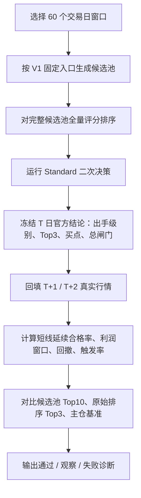

# 强势筛选 V1 回测验收标准

## 1. 文档信息

- 文档名称：强势筛选 V1 回测验收标准
- 英文名称：Momentum Screener V1 Backtest Acceptance Criteria
- 所属系统：`daily_stock_analysis`
- 文档类型：回测验收口径 / 诊断标准 / 开发协作说明
- 当前状态：`draft v1.0`
- 最后更新：`2026-04-26`
- 关联文档：
  - [强势筛选 V1 回测与问题诊断框架](./momentum-screener-v1-backtest-and-diagnosis-framework.md)
  - [强势筛选 V1 回测数据口径与结果面板设计](./momentum-screener-v1-backtest-metrics-and-dashboard.md)
  - [强势筛选 V1 产品原则 + 总闸门规则](./momentum-screener-v1-product-principles-and-gate-rules.md)

## 2. 使用场景

本文档用于统一开发、测试和产品复盘时的回测验收标准。

当任一开发者完成强势筛选主链路、二次决策、买点、总闸门或回测统计口径改动后，必须按本文档执行同一套 60 交易日回测诊断，并用同一套通过 / 观察 / 失败标准判断系统是否可继续上线。

一句话原则：

**回测验收不是只看收益，而是先看方向是否选对，再看组合是否优于基准，最后看风险和总闸门是否可解释。**

## 3. 固定回测基线

所有 V1 官方回测必须固定以下生产基线，不允许临时改参数后再比较结果。

| 项目 | 最新验收口径 |
| --- | --- |
| 回测窗口 | 标准窗口为 `60` 个交易日 |
| 市场范围 | 主板 + 创业板 + 科创板 |
| 候选池入口 | 最小涨幅 `4%` / 最小成交额 `2 亿` / 最小换手率 `2%` |
| 官方主引擎 | `Standard` |
| Aggressive | 只做进攻补充观察，不进入官方胜率 |
| 页面展示数量 | 固定 `Top30`，只影响展示，不影响二次决策 |
| 决策链路 | 候选池 -> 全量评分排序 -> Standard 二次决策 -> 官方 Top3 -> T+1/T+2 结果回填 |
| 可用信息边界 | `T` 日只能使用 `T` 日收盘后可见信息，不允许使用未来数据 |

若任一项不一致，本次回测不能和官方历史报告横向比较，只能标记为“研究样本”。

## 4. 标准回测流程



推荐命令：

```bash
python scripts/start_momentum_backtest_task.py \
  --base-url http://163.7.12.193 \
  --start-trade-date YYYY-MM-DD \
  --end-trade-date YYYY-MM-DD \
  --profile standard \
  --top-n 30 \
  --timeout 180
```

若专门验证 20/60 历史窗口本身，再追加：

```bash
--strict-strategy-health
```

注意：`strict_strategy_health=true` 是研究口径，用于验证 20/60 窗口规则是否合理；普通 V1 生产链路验收默认使用 `cached_only`，避免把 20/60 历史验证耗时混入主链路可用性判断。

## 5. 主胜率口径：短线延续合格率

V1.4 起，官方回测主胜率统一改为 `短线延续合格率`，不再使用简单的 `T+2 收盘正收益率`。

单个样本必须同时满足两个条件，才算合格：

| 子条件 | 计算规则 | 含义 |
| --- | --- | --- |
| `T+1 方向确认` | `T+1 收盘价 > T+1 开盘价` | 次日资金仍愿意向上推进 |
| `T+2 延续窗口` | `T+2 最高价 > T+1 收盘价` | 后日给过继续冲高或兑现窗口 |
| `短线延续合格` | 两个条件同时满足 | 本次选股方向合格 |

对应字段：

| 字段 | 含义 |
| --- | --- |
| `settlement_rule` | 当前结算规则，固定为 `t1_close_gt_open_and_t2_high_gt_t1_close` |
| `t1_direction_pass` | 是否满足 `T+1 收盘价 > T+1 开盘价` |
| `t2_continuation_pass` | 是否满足 `T+2 最高价 > T+1 收盘价` |
| `settlement_pass` | 是否短线延续合格 |
| `settlement_pass_rate_pct` | 短线延续合格率 |

利润窗口、最大回撤和买点触发率仍然保留，但它们是执行质量和风险指标，不再定义主胜率。

## 6. 必须对比的基准

每份 60 交易日诊断报告至少要同时比较四组对象。

| 对象 | 用途 | 必看指标 |
| --- | --- | --- |
| 官方 Top3 | 系统最终答案 | 短线延续合格率、平均利润窗口、平均最大回撤 |
| 候选池 Top10 | 判断候选池质量 | Top10 是否本身有赚钱效应 |
| 原始排序 Top3 | 判断二次决策是否有增益 | 官方 Top3 是否优于简单排序 |
| 主仓基准 | 判断最优先标的是否真的更优 | 主仓是否优于次仓 / 观察仓 / 组合均值 |

不能只看官方 Top3 单独胜率。若官方 Top3 胜率不错，但不如候选池 Top10 或原始排序 Top3，说明二次决策没有创造增量价值。

## 7. 核心验收指标

### 7.1 方向有效性

| 结论 | 官方 Top3 短线延续合格率 |
| --- | --- |
| 通过 | `>= 55%` |
| 观察 | `50% ~ 55%` |
| 失败 | `< 50%` |

解释：

- `50%` 是随机方向附近的底线，低于该值说明系统没有稳定方向优势。
- `55%` 是 V1 当前“可用”的最低标准，代表系统已经明显高于随机判断。
- `>= 60%` 可视为强表现，允许进入更积极的参数和买点优化讨论。

### 7.2 相对增益

官方 Top3 必须至少满足以下一项，才算二次决策有增益：

| 对比项 | 通过标准 |
| --- | --- |
| 相对候选池 Top10 | 官方 Top3 合格率高于 Top10，或利润窗口更高且回撤不明显恶化 |
| 相对原始排序 Top3 | 官方 Top3 不得低于原始排序 Top3 超过 `3` 个百分点 |
| 相对主仓基准 | 主仓合格率不得长期低于官方 Top3 均值超过 `5` 个百分点 |

如果官方 Top3 绝对胜率达标，但相对基准没有增益，结论只能是“候选池有效，二次决策待校准”，不能直接判定整套系统优秀。

### 7.3 执行舒适度

| 指标 | 通过 | 观察 | 失败 |
| --- | --- | --- | --- |
| 平均 T+2 利润窗口 | `>= 2.0%` | `1.0% ~ 2.0%` | `< 1.0%` |
| Standard 平均最大回撤 | `<= 5.0%` | `5.0% ~ 8.0%` | `> 8.0%` |
| 买点触发率 | `40% ~ 85%` | `25% ~ 40%` 或 `85% ~ 95%` | `< 25%` 或 `> 95%` |

解释：

- 利润窗口判断有没有足够兑现空间。
- 回撤判断强势股波动是否仍在可承受范围内。
- 触发率过低说明买点太苛刻，触发率过高但胜率和回撤没有改善，说明买点太宽松。

### 7.4 总闸门质量

| 指标 | 通过标准 |
| --- | --- |
| 放行准确率 | `可做 / 谨慎出手` 的交易日，官方 Top3 合格率应高于整体均值 |
| 劝退准确率 | `仅观察 / 今日不做` 的交易日，候选池和官方 Top3 表现应低于整体均值 |
| 错杀率 | 系统劝退但候选池 Top10 或官方 Top3 明显走强的交易日，不应持续集中出现 |
| 弱市控制 | 弱市分桶中出手次数应减少，平均回撤不应明显放大 |

若总闸门过度保守，报告必须单独标注“错杀问题”；若总闸门过度激进，报告必须单独标注“误放行问题”。

### 7.5 数据完整性

| 项目 | 通过标准 |
| --- | --- |
| 完成交易日 | 60 交易日窗口至少完成 `58` 个交易日 |
| 失败交易日 | 失败交易日不超过 `2` 个 |
| outcome 回填 | 官方 Top3 和候选池 Top10 的 T+1/T+2 outcome 基本完整 |
| 版本冻结 | 报告必须记录 `engine_version`、`entry_baseline_version`、`market_scope_version`、`strategy_health_mode` |

数据完整性不达标时，本次结果不能用于策略可用性判断，只能用于排障。

## 8. 最终验收结论分级

| 结论 | 判定条件 | 后续动作 |
| --- | --- | --- |
| `通过` | 官方 Top3 合格率 `>=55%`，且相对基准有增益，风险指标不失败 | 可以作为当前生产链路继续使用 |
| `强通过` | 官方 Top3 合格率 `>=60%`，且主仓 / Top3 / 总闸门均优于基准 | 可以进入买点、盘中信号和仓位提示优化 |
| `观察通过` | 官方 Top3 合格率 `50%~55%`，但相对基准或风险指标有明显优势 | 可以上线观察，但不能宣传为稳定有效 |
| `失败` | 官方 Top3 合格率 `<50%`，或明显弱于候选池 / 原始排序基准 | 必须回到入口、排序或二次决策规则重新校准 |
| `无效样本` | 数据缺失、窗口不足、版本混用或存在未来函数 | 本次报告作废，先修回测链路 |

## 9. 失败归因顺序

当验收未通过时，诊断报告必须按以下顺序定位问题。

1. 入口层：强票是否进入候选池。
2. 排序层：候选池里真正走强的票是否排在前面。
3. 二次决策层：官方 Top3 是否优于原始排序 Top3。
4. 买点层：触发率、利润窗口和回撤是否合理。
5. 总闸门层：是否过度劝退或过度放行。
6. 市场环境层：问题是否只集中在弱市、震荡市或特定主线环境。
7. 数据层：是否存在缺失、降级、缓存复用或版本混用。

诊断结论必须落到具体层级，不能只写“胜率不够”。

## 10. 报告模板

每次 60 交易日回测完成后，建议按以下结构输出诊断报告。

```markdown
# 强势筛选 V1 60 交易日回测诊断报告

## 1. 回测元信息

- run_id:
- 交易日区间:
- 完成交易日:
- strategy_health_mode:
- engine_version:
- entry_baseline_version:
- market_scope_version:

## 2. 一句话结论

结论：通过 / 强通过 / 观察通过 / 失败 / 无效样本。
原因：用 1-2 句话说明最核心依据。

## 3. 核心指标

| 指标 | 官方 Top3 | 候选池 Top10 | 原始排序 Top3 | 主仓 |
| --- | --- | --- | --- | --- |
| 短线延续合格率 |  |  |  |  |
| 平均 T+2 利润窗口 |  |  |  |  |
| 平均最大回撤 |  |  |  |  |
| 买点触发率 |  |  |  |  |

## 4. 相对基准结论

- 相对候选池 Top10：
- 相对原始排序 Top3：
- 相对主仓基准：

## 5. 总闸门诊断

- 放行是否有效：
- 劝退是否有效：
- 是否存在错杀：
- 是否存在误放行：

## 6. 分层问题定位

- 入口层：
- 排序层：
- 二次决策层：
- 买点层：
- 总闸门层：
- 市场环境层：
- 数据层：

## 7. 下一步建议

1.
2.
3.
```

## 11. 开发注意事项

- 新增任何影响回测结论的字段或规则时，必须同步更新本文档。
- `positive_t2_rate_pct` 在强势筛选 V1 回测语境中兼容表示“短线延续合格率”，不要再解释为 `T+2 收盘正收益率`。
- 页面文案优先使用“短线延续合格率”或“延续合格率”，避免回到旧口径。
- 20/60 历史窗口用于解释总闸门和风险温度，不是主胜率本身；主胜率仍以 `settlement_pass_rate_pct` 为准。
- 若回测结果与页面结果不一致，优先检查是否命中旧 run 缓存、是否版本混用、是否仍在使用旧 outcome payload。
