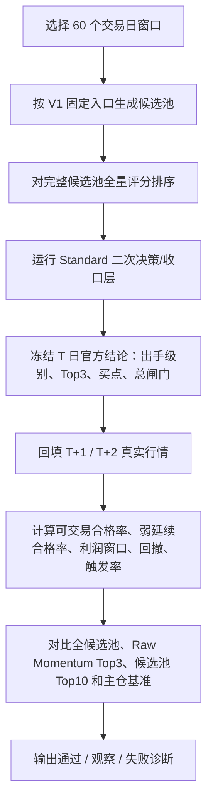

# 强势筛选 V1 回测验收标准

## 1. 文档信息

- 文档名称：强势筛选 V1 回测验收标准
- 英文名称：Momentum Screener V1 Backtest Acceptance Criteria
- 所属系统：`daily_stock_analysis`
- 文档类型：回测验收口径 / 诊断标准 / 开发协作说明
- 当前状态：`draft v1.1`
- 最后更新：`2026-04-29`
- 关联文档：
  - [强势筛选 V1 回测与问题诊断框架](./momentum-screener-v1-backtest-and-diagnosis-framework.md)
  - [强势筛选 V1 回测数据口径与结果面板设计](./momentum-screener-v1-backtest-metrics-and-dashboard.md)
  - [强势筛选 V1 产品原则与总闸门规则](./momentum-screener-v1-product-principles-and-gate-rules.md)

## 2. 使用场景

本文档用于统一开发、测试和产品复盘时的回测验收标准。

当任一开发者完成强势筛选主链路、二次决策/收口层、买点、总闸门或回测统计口径改动后，必须按本文档执行同一套 `60` 交易日回测诊断，并用同一套 `通过 / 观察 / 失败 / 无效样本` 标准判断系统是否可继续作为当前生产链路使用。

一句话原则：

**回测验收不是只看收益，而是先看方向是否选对，再看官方链路是否优于关键基准，最后看风险和总闸门是否可解释。**

## 3. 固定回测基线

所有 V1 官方回测必须固定以下生产基线，不允许临时改参数后再横向比较结果。

| 项目 | 最新验收口径 |
| --- | --- |
| 回测窗口 | 标准窗口为 `60` 个交易日 |
| 市场范围 | 主板 + 创业板 + 科创板 |
| 候选池入口 | 最小涨幅 `4%` / 最小成交额 `2 亿` / 最小换手率 `2%` |
| 官方主引擎 | `Standard` |
| Aggressive | 只做进攻补充观察，不进入官方胜率 |
| 页面展示数量 | 固定 `Top30`，只影响展示，不影响二次决策 |
| 决策链路 | 候选池 -> 全量评分排序 -> Standard 二次决策 -> 官方 Top3 -> T+1/T+2 结果回填 |
| 可用信息边界 | `T` 日只能使用 `T` 日收盘后可见信息，不允许使用未来数据 |

若任一项不一致，本次回测不能与官方历史报告横向比较，只能标记为“研究样本”。

## 4. 标准回测流程



推荐命令：

```bash
python scripts/start_momentum_backtest_task.py \
  --base-url http://163.7.12.193 \
  --start-trade-date YYYY-MM-DD \
  --end-trade-date YYYY-MM-DD \
  --profile standard \
  --top-n 30 \
  --timeout 180
```

若专门验证 `20/60` 历史窗口本身，再追加：

```bash
--strict-strategy-health
```

注意：`strict_strategy_health=true` 是研究口径，用于验证 `20/60` 窗口规则是否合理；普通 V1 生产链路验收默认使用 `cached_only`，避免把 `20/60` 历史验证耗时混入主链路可用性判断。

## 5. 主胜率口径：V1.3 双层验收

V1.3 起，官方回测采用双层验收：`弱延续合格率` 只作为方向辅助指标，`可交易合格率` 作为主胜率和 Label=1 的真实验收标准。

### 5.1 弱延续合格率（辅助）

弱延续用于判断方向是否仍有惯性，不再作为主胜率。

| 子条件 | 计算规则 | 含义 |
| --- | --- | --- |
| `T+1 方向确认` | `T+1 收盘价 > T+1 开盘价` | 次日资金仍愿意向上推进 |
| `T+2 弱延续窗口` | `T+2 最高价 > T+1 收盘价` | 后日给过继续冲高或兑现窗口 |
| `弱延续合格` | 两个条件同时满足 | 方向有延续，但未必可交易获利 |

### 5.2 可交易合格率（主标准）

单个样本必须同时满足以下条件，才算 `可交易合格`：

| 子条件 | 计算规则 | 含义 |
| --- | --- | --- |
| `T+1 可买性` | `T+1` 不是 `open == high == low == close` 的一字不可买结构 | 排除看对但买不到的样本 |
| `T+1 风险过滤` | `T+1 open >= T0 close * 0.99` | 过滤深低开和滑点损失难覆盖的样本 |
| `T+1 方向确认` | `T+1 close > T+1 open` | 次日仍有资金向上推进 |
| `T+2 滑点退出缓冲` | `(T+2 high + T+2 close) / 2 >= T+1 close * 1.02` | 用滑点调整退出价过滤瞬时冲高，至少给出 `2%` 的可成交兑现空间 |
| `可交易合格` | 四个条件同时满足 | 本次选股具备实盘可执行意义 |

对应字段：

| 字段 | 含义 |
| --- | --- |
| `weak_continuity_rule` | 弱延续辅助规则，固定为 `t1_close_gt_open_and_t2_high_gt_t1_close` |
| `weak_continuity_pass` | 是否满足弱延续辅助规则 |
| `weak_continuity_pass_rate_pct` | 弱延续合格率 |
| `settlement_rule` | 当前主验收规则，固定为 `v13_tradable_success_v1` |
| `tradable_success_rule` | 可交易合格主规则，当前为 `t1_buyable_no_one_word_open_ge_t0_close_0_99_t1_close_gt_open_t2_adjusted_exit_ge_t1_close_1_02` |
| `tradable_success_pass` / `settlement_pass` | 是否满足可交易合格主规则 |
| `tradable_success_rate_pct` / `settlement_pass_rate_pct` | 可交易合格率 |

利润窗口、最大回撤和买点触发率仍然保留，但它们是执行质量和风险指标；主胜率以 `tradable_success_rate_pct` 为准。

## 6. 必须对比的基准

每份 `60` 交易日诊断报告至少要同时比较五组对象。

| 对象 | 用途 | 必看指标 |
| --- | --- | --- |
| 官方 Top3 | 系统最终答案 | 可交易合格率、弱延续合格率、平均利润窗口、平均最大回撤 |
| 全候选池基准 | 判断固定入口本身的赚钱效应 | 官方 Top3 是否正在创造或破坏池子 Alpha |
| Raw Momentum Top3 | 判断 V1.3 过滤层是否优于初始动量排序 | Selection Efficiency 是否为正 |
| 候选池 Top10 | 判断候选池质量 | Top10 是否本身有赚钱效应 |
| 主仓基准 | 判断主仓锚点是否稳定承担组合核心职责 | 主仓是否长期弱于官方 Top3 均值 |

不能只看官方 Top3 单独胜率。若官方 Top3 胜率不错，但低于全候选池基准，说明筛选器正在破坏候选池本身的 Alpha；若低于 Raw Momentum Top3，说明 V1.3 过滤层可能过度主观或错杀强势龙头；若主要弱于主仓基准，更像是主仓锚点或总闸门过度偏移。

## 7. 核心验收指标

### 7.1 可交易有效性

| 结论 | 官方 Top3 可交易合格率 |
| --- | --- |
| 通过 | `>= 55%` |
| 观察 | `50% ~ 55%` |
| 失败 | `< 50%` |

解释：

- `50%` 是可交易样本的底线，低于该值说明系统没有稳定实盘可执行优势。
- `55%` 是 V1 当前“可用”的最低标准，代表系统已经明显高于弱延续噪音判断。
- `>= 60%` 可视为强表现，允许进入更积极的参数和买点优化讨论。

### 7.2 Strategy Alpha 与收口稳定性

Stage 2 起，这一门槛正式用于证伪 V1.3 过滤层是否真的创造价值。主排序层承担“谁更强”的正式判断；二次决策和画像过滤必须证明它们没有把候选池中的可交易机会过滤坏。

因此，这一节主要回答三件事：

1. 官方链路是否把候选池机会有效转成可执行组合；
2. V1.3 过滤层是否优于不加过滤的 Raw Momentum Top3；
3. 收口层是否过度偏离主仓锚点和总闸门目标。

| 对比项 | 通过标准 | 验收含义 |
| --- | --- | --- |
| V1.3 Alpha vs Pool | 官方 Top3 可交易合格率至少高于全候选池基准 `15` 个百分点；若低于全池，输出 `LOGIC FAILURE: Screener is destroying Pool Alpha`；若高于全池但不足 `15pct`，输出 `ALPHA_EROSION_DETECTED: Refine Secondary Decision Weights` | 判断筛选器是否创造足够的池子 Alpha |
| Selection Efficiency | 官方 Top3 可交易合格率不得长期低于 Raw Momentum Top3；若长期为负，复核主线、画像、封板强度和总闸门参数 | 判断 V1.3 过滤层是否真正提高选择效率 |
| 相对候选池 Top10 | 官方 Top3 合格率高于 Top10，或利润窗口更高且回撤不明显恶化 | 判断整条官方链路是否有效提炼候选池机会 |
| 相对主仓基准 | 主仓合格率不得长期低于官方 Top3 均值超过 `5` 个百分点 | 判断主仓锚点是否稳定承担组合核心职责 |

如果官方 Top3 绝对胜率达标，但低于全候选池基准，结论必须优先写成“过滤层逻辑失败”；如果只低于 Raw Momentum Top3，但仍高于全池，结论写成“过滤层选择效率待校准”。

如果官方 Top3 主要弱于候选池 Top10，更优先怀疑主排序或 Top10 收口；如果主要弱于主仓基准，更优先怀疑主仓锚点或总闸门。

### 7.3 执行舒适度

| 指标 | 通过 | 观察 | 失败 |
| --- | --- | --- | --- |
| 平均 T+2 利润窗口 | `>= 2.0%` | `1.0% ~ 2.0%` | `< 1.0%` |
| Standard 平均最大回撤 | `<= 5.0%` | `5.0% ~ 8.0%` | `> 8.0%` |
| 买点触发率 | `40% ~ 85%` | `25% ~ 40%` 或 `85% ~ 95%` | `< 25%` 或 `> 95%` |

解释：

- 利润窗口判断有没有足够兑现空间。
- 回撤判断强势股波动是否仍在可承受范围内。
- 触发率过低说明买点过苛刻；触发率过高但胜率和回撤没有改善，说明买点过宽松。

### 7.4 总闸门质量

| 指标 | 通过标准 |
| --- | --- |
| 放行准确率 | `可做 / 谨慎出手` 的交易日，官方 Top3 合格率应高于整体均值 |
| 劝退准确率 | `仅观察 / 今日不做` 的交易日，候选池和官方 Top3 表现应低于整体均值 |
| 错杀率 | 系统劝退但候选池 Top10 或官方 Top3 明显走强的交易日，不应持续集中出现 |
| 弱市控制 | 弱市分档中出手次数应减少，平均回撤不应明显放大 |

当前实现里，可直接参考 `allowed_trade_precision_pct`、`missed_opportunity_rate_pct`、`gate_module_breakdown` 和 `layer_diagnostics.gate` 做辅助判断。

若总闸门过度保守，报告必须单独标注“错杀问题”；若总闸门过度激进，报告必须单独标注“误放行问题”。

### 7.5 数据完整性

| 项目 | 通过标准 |
| --- | --- |
| 完成交易日 | `60` 交易日窗口至少完成 `58` 个交易日 |
| 失败交易日 | 失败交易日不超过 `2` 个 |
| outcome 回填 | 官方 Top3、全候选池、Raw Momentum Top3 和候选池 Top10 的 T+1/T+2 outcome 基本完整 |
| 版本冻结 | 报告必须记录 `engine_version`、`entry_baseline_version`、`market_scope_version`、`strategy_health_mode` |

### 7.6 Tick-Level Graceful Degradation

单只候选股历史日线、画像、历史健康度或 T+1/T+2 outcome 回填中的 Tushare / 网络请求临时超时，不应直接判定整日失败。系统必须按单股粒度记录 warning，剔除该股票当次样本，并继续处理当天剩余候选。

若单日被跳过候选过多导致候选池、Official Top3、Raw Momentum Top3 或 outcome 不完整，再在数据完整性诊断中标注该交易日为低置信样本；只有当可用样本不足以计算核心指标时，才将该交易日或本次 run 判为无效样本。

数据完整性不达标时，本次结果不能用于策略可用性判断，只能用于排障。

## 8. 最终验收结论分级

| 结论 | 判定条件 | 后续动作 |
| --- | --- | --- |
| `通过` | 官方 Top3 合格率 `>=55%`，且相对基准达标，风险指标不失败 | 可以作为当前生产链路继续使用 |
| `强通过` | 官方 Top3 合格率 `>=60%`，且主仓 / Top3 / 总闸门均优于基准 | 可以进入买点、盘中信号和仓位提示优化 |
| `观察通过` | 官方 Top3 合格率 `50%~55%`，但相对基准或风险指标有明显优势 | 可以上线观察，但不能宣传为稳定有效 |
| `失败` | 官方 Top3 合格率 `<50%`，或低于全候选池基准，或长期弱于 Raw Momentum Top3 / 主仓基准 | 必须回到入口、主排序、收口层或总闸门规则重新校准 |
| `无效样本` | 数据缺失、窗口不足、版本混用或存在未来函数 | 本次报告作废，先修回测链路 |

## 9. 失败归因顺序

当验收未通过时，诊断报告必须按以下顺序定位问题。

1. 入口层：强票是否进入候选池。
2. 排序层：候选池里真正走强的票是否排在前面。
3. 收口层：官方 Top3 / 主仓 / 次仓 / 观察仓是否弱于 Raw Momentum Top3，或是否把全候选池 Alpha 过滤坏。
4. 买点层：触发率、利润窗口和回撤是否合理。
5. 总闸门层：是否过度劝退或过度放行。
6. 市场环境层：问题是否只集中在弱市、震荡市或特定主线环境。
7. 数据层：是否存在缺失、降级、缓存复用或版本混用。

诊断结论必须落到具体层级，不能只写“胜率不够”。

## 10. 报告模板

每次 `60` 交易日回测完成后，建议按以下结构输出诊断报告。

```markdown
# 强势筛选 V1 60 交易日回测诊断报告

## 1. 回测元信息
- run_id:
- 交易日区间:
- 完成交易日:
- strategy_health_mode:
- engine_version:
- entry_baseline_version:
- market_scope_version:

## 2. 一句话结论

结论：通过 / 强通过 / 观察通过 / 失败 / 无效样本。
原因：用 1-2 句话说明最核心依据。

## 3. 核心指标

| 指标 | 官方 Top3 | 全候选池 | Raw Momentum Top3 | 候选池 Top10 | 主仓 |
| --- | --- | --- | --- | --- | --- |
| 可交易合格率 |  |  |  |  |  |
| 弱延续合格率 |  |  |  |  |  |
| 平均 T+2 利润窗口 |  |  |  |  |  |
| 平均最大回撤 |  |  |  |  |  |
| 买点触发率 |  |  |  |  |  |

## 4. 相对基准结论

- V1.3 Alpha vs Pool：
- Selection Efficiency：
- 相对候选池 Top10：
- 相对主仓基准：

## 4.1 Daily Swap Analysis

- ticker_swap_log 覆盖天数：
- Official 输给 Raw 的交易日：
- Dropped by V1.3（Raw 选中但 Official 剔除）：
- Inserted by V1.3（Official 插入但 Raw 未选）：
- 初步归因：Risk Stack / Mainline Intensity / 封板强度 / 买点收口 / 其他

## 5. 总闸门诊断

- 放行是否有效：
- 劝退是否有效：
- 是否存在错杀：
- 是否存在误放行：

## 6. 分层问题定位

- 入口层：
- 排序层：
- 收口层：
- 买点层：
- 总闸门层：
- 市场环境层：
- 数据层：

## 7. 下一步建议
1.
2.
3.
```

## 11. 开发注意事项

- 新增任何影响回测结论的字段或规则时，必须同步更新本文档。
- `positive_t2_rate_pct` 在强势筛选 V1.3 回测语境中兼容表示“可交易合格率”，不要再解释为 `T+2 收盘正收益率`。
- 页面文案优先同时展示“可交易合格率”和“弱延续合格率”，避免把方向惯性误当成实盘可交易。
- `20/60` 历史窗口用于解释总闸门和风险温度，不是主胜率本身；主胜率以 `tradable_success_rate_pct` / `settlement_pass_rate_pct` 为准。
- V1.3 Stage 2 起，`Raw Momentum Top3` 是不经过二次决策和主线过滤的初始动量排序基准，用于计算 `Selection Efficiency`。
- 全候选池基准是固定入口完整样本，用于计算 `V1.3 Alpha vs Pool`；官方 Top3 低于全池时必须优先标记逻辑失败。
- V1.3 Stage 7 起，回测 summary 必须输出 `ticker_swap_log`：当 Official Top3 单日弱于 Raw Momentum Top3 时，列出 `dropped_by_v13` 与 `inserted_by_v13`，用于定位 Risk Stack、Mainline Intensity 或买点收口是否产生负贡献。
- `ticker_swap_log` 必须复用回测过程中已经冻结的 `candidate_pool`、`decision_top3` 与 outcome 记录生成，不得为了 Raw Top3 对比重新运行完整 analyzer；T 日快照中的 `moneyflow`、`daily_basic.turnover_rate_f` 等字段按交易日批量拉取并进入缓存，`cyq_chips` 这类必须逐股真查的重接口采用有限并发 + 单股降级缓存，以降低 60 日严格回测的重复 I/O 和 DNS 抖动放大效应。
- 若回测结果与页面结果不一致，优先检查是否命中旧 run 缓存、是否版本混用、是否仍在使用旧 outcome payload。
