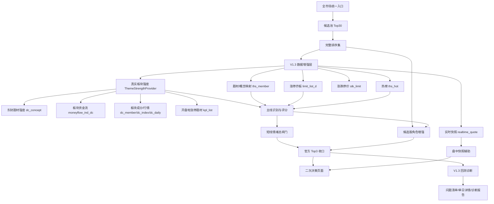

# 强势筛选 V1.3 主线增强版技术开发文档

## 1. 文档信息

- 文档名称：强势筛选 V1.3 主线增强版技术开发文档
- 英文名称：Momentum Screener V1.3 Mainline Enhancement Technical Design
- 所属系统：`daily_stock_analysis`
- 文档类型：技术开发文档 / 实现设计
- 当前状态：`draft v0.1`
- 最后更新：`2026-04-25`
- 关联文档：
  - [强势筛选 V1.3 主线增强版产品设计](./momentum-screener-v1-3-mainline-enhancement-product-design.md)
  - [强势筛选 V1.3 主线增强版开发任务清单](./momentum-screener-v1-3-development-tasks.md)
  - [强势筛选二次决策与执行辅助 SPEC](./momentum-screener-secondary-decision-spec.md)
  - [强势筛选二次决策与执行辅助技术开发文档](./momentum-screener-secondary-decision-technical-design.md)
  - [强势筛选 V1 产品原则 + 总闸门规则](./momentum-screener-v1-product-principles-and-gate-rules.md)
  - [强势筛选 V1 回测与问题诊断框架](./momentum-screener-v1-backtest-and-diagnosis-framework.md)

## 2. 目标与边界

V1.3 的技术目标是：在当前 `6000` 积分预算下，把强势筛选从“候选股排序”升级为“真实板块强度识别 + 主线识别 + 短线情绪 + 角色收口 + 回测诊断”的稳定生产链路。

本次技术文档只定义实现方案，不直接修改业务代码。

### 2.1 本次实现范围

- 接入并标准化 `dc_concept / moneyflow_ind_dc / dc_member / dc_index / dc_daily / kpl_list / stk_limit / limit_list_d / ths_member / ths_hot / realtime_quote` 数据。
- 新增 `ThemeStrengthProvider`，优先用东方财富题材强度、板块资金流和板块成分回答“资金去了哪些强势板块”。
- 为候选池补充题材 / 概念映射，形成主线候选。
- 基于主线密度、涨停强度、炸板风险、热榜集中度和昨日强势反馈计算主线评分。
- 将短线情绪接入总闸门，辅助判断当天是否适合继续做强势股。
- 将官方 Top3 的选择从单股排序升级为 `单股强度 + 主线强度 + 情绪环境 + 角色地位`。
- 在回测中新增 V1.3 诊断维度，定位失败原因。
- 在页面中新增主线雷达、短线情绪、盘中快照辅助和回测诊断表达。

### 2.2 本次明确不做

- 不接入股票实时分钟线或股票历史分钟线。
- 不做分时均线 / VWAP 承接确认。
- 不做逐笔成交、Level-2、自动交易或券商下单。
- 不输出 `分钟级买点正式触发`、`分时承接已确认`、`建议买入` 等高置信度盘中交易指令。

## 3. 当前系统落点

V1.3 应优先复用当前强势筛选主链路，不新增平行产品入口。

| 层级 | 当前文件 / 模块 | V1.3 改造方向 |
| --- | --- | --- |
| API | `api/v1/endpoints/stocks.py` | 复用强势筛选、二次决策、盘中信号和回测 endpoint，扩展响应字段 |
| API Schema | `api/v1/schemas/stocks.py` | 新增主线雷达、短线情绪、快照辅助、V1.3 诊断字段 |
| 数据源 | `data_provider/tushare_fetcher.py` | 补充 6000 积分相关接口封装与标准化 |
| 筛选服务 | `src/services/momentum_screener_service.py` | 保持候选池统一入口和 Top30 官方展示 |
| 二次决策服务 | `src/services/momentum_secondary_decision_service.py` | 新增 V1.3 主线增强上下文、主线评分、情绪闸门、角色增强 |
| 回测服务 | `src/services/momentum_backtest_service.py` | 冻结 V1.3 输入快照，新增主线 / 情绪 / 角色 / 价格位置诊断 |
| 回测仓储 | `src/repositories/momentum_backtest_repo.py` | 复用现有 JSON payload 字段，必要时追加兼容字段 |
| 前端 API | `apps/dsa-web/src/api/momentumScreener.ts`、`apps/dsa-web/src/api/momentumBacktest.ts` | 扩展类型与渲染数据 |
| 前端页面 | `apps/dsa-web/src/pages/MomentumScreenerPage.tsx`、`apps/dsa-web/src/components/history/MomentumBacktestPanel.tsx` | 新增 V1.3 页面模块 |
| AI 点评 | `src/services/momentum_screener_ai_commentary_service.py` | 将 V1.3 规则结论作为解释上下文，不让 AI 覆盖规则边界 |

### 3.1 回测结算兼容约定

V1.4 起，`positive_t2_rate_pct` 和上层 `*_positive_t2_rate` 在强势筛选 V1 回测语境中代表 `短线延续合格率`，不再代表 `T+2 收盘正收益率`。后端同时在 outcome payload 中写入：

- `settlement_rule = t1_close_gt_open_and_t2_high_gt_t1_close`
- `t1_direction_pass`
- `t2_continuation_pass`
- `settlement_pass`

这样既保持旧接口字段兼容，也能在单日详情中解释每只票为什么合格或不合格。

## 4. 总体架构



关键原则：

- 候选池入口仍固定为官方生产入口，普通用户不可调整。
- V1.3 不改变 `Standard` 官方主链路地位。
- `Aggressive` 仍是进攻补充观察层，不参与官方 Top3 最终收口。
- 主线增强基于完整排序集，不受页面展示数量变化影响。

### 4.0.1 排序引擎重构边界（2026-04-27 冻结）

当前实现中的“旧 V1 基础评分 + V1.3 局部增强”只能视为过渡态，不是最终目标。技术方案需要收口到以下边界：

1. `MomentumScreenerService.screen()` 在初筛完成后，必须支持对**全部候选股票**构建新版评分画像并重算官方排序分。
2. `truth_mode=light`、`Top12`、`Top30` 或任何展示子集增强，只能作为过渡期性能策略，不能定义为正式排序口径。
3. `candidate_diagnostics`、`v13_shadow_score`、`secondary_decision` 继续存在，但它们的职责是：
   - 解释排序结果
   - 做组合收口
   - 做回测诊断

   它们不能替代主排序引擎重构。
4. 新版主排序链应以“全候选画像 -> 全候选评分 -> 官方排序结果”为中心，而不是“旧排序 -> 局部增强 -> 解释层补丁”。
5. 性能方案只能通过快照、分页、缓存、任务化与断点续跑支撑全候选重评分；不得通过减少评分覆盖股票数降低真实性。

推荐主链路调整为：

```text
候选池初筛
-> 全候选 V1.3/V1.5 数据画像
-> 全候选 Standard / Aggressive 重评分
-> 官方排序结果
-> 二次决策 / 解释层 / 回测诊断
```

因此，现有这些实现应被视为待替换或待下沉的过渡逻辑：

- 只对前排股票构建 `v13_profile_map`
- 将 `Top12` 局部增强结果直接用于生产排序
- 把影子分作为“排序升级是否成功”的主要观察口径

### 4.0.2 用户侧唯一官方总分边界（2026-04-27 冻结）

用户侧个股列表的排序语义需要与主排序重构保持一致，因此技术层面冻结以下边界：

1. 前端结果表默认且固定按一个正式顺序展示，该顺序对外统一命名为：`官方总分`。
2. 在主排序引擎完全重构完成前，`官方总分` 先由现有 `rank_score` 承担；待新版全候选重评分公式稳定后，再切换为新公式产物，但对外命名不变。
3. `final_score`、`continuation_score`、`extension_score`、`risk_score`、`buyability_score` 继续保留在 payload 中，作为解释层字段，不再作为普通用户的列表重排入口。
4. 强势筛选页对普通用户不再暴露“按延续分 / 按弹性分 / 按风险分 / 按可买分”之类的多排序下拉；若研发或回归需要保留多排序观察，应明确置于调试模式或导出明细中。
5. 后端排序结果与字段命名应支持这一产品心智：系统永远只给一个正式顺序，其他分值只负责拆解为什么排成这样，而不是鼓励用户自行挑选另一个更可信的排序。

对应的兼容策略为：

- 短期保持现有 `rank_score` 字段不删，避免 API / 回测 / 导出兼容性破坏。
- 中期由前端把用户可见文案统一成 `官方总分`，并在详情抽屉中区分“官方总分 / 基础总分 / 风险分 / 可买分”等解释字段。
- 长期当主排序公式完成替换后，仅修改 `官方总分` 的内部计算来源，不再新增第二个平行“正式总分”字段。

### 4.0.3 全候选主排序引擎实施落点（2026-04-27 冻结）

当前主排序重构不再停留在原则层，技术实施落点明确为对 `MomentumScreenerService` 的正式评分主链做一次结构调整。

#### 4.0.3.1 当前过渡实现的主要问题

结合现有代码路径，当前过渡态主要表现为：

- `screen()` 先完成旧版候选评分，再进入 V1.3 增强
- `_score_candidates()` 先走 `_score_standard()` / `_score_aggressive()` 产出 provisional results
- `_build_standard_v13_profile_map()` 再基于 provisional results 回头补 `v13_profile`
- `truth_mode=light` 下默认只覆盖前排候选，`truth_mode=full` 才放开到更多样本

这使得当前排序链更像：

```text
旧特征
-> 旧评分
-> 旧排序结果
-> V1.3 局部补强
-> 重新排序
```

而不是目标中的：

```text
候选池初筛
-> 全候选新画像
-> 全候选统一评分
-> 官方总分
```

#### 4.0.3.2 目标中的正式评分主链

重构后的主排序主链建议收敛为以下步骤：

1. **候选池初筛**
   - 保留当前 `4% / 2亿 / 2% + Top30 展示` 的官方入口语义
   - 只决定谁进入后续评分池
2. **全候选画像构建**
   - 对初筛后的全部候选统一构建新画像
   - 画像至少覆盖：
     - 真实题材映射
     - 板块资金强度
     - 个股资金承接
     - 涨停 / 炸板 / 开板结构
     - `kpl_list` 状态与换手语义
     - `cyq_perf / cyq_chips` 筹码压力
3. **统一评分**
   - `Standard` 与 `Aggressive` 都在同一套全候选画像上打分
   - 不再允许“先旧分，后补前排”的正式生产口径
4. **官方总分产出**
   - 对外只有一个正式顺序
   - ??????? `official_score` ??????`rank_score` ???????
   - 长期可以切换计算来源，但不切换用户心智
5. **解释层与二次决策**
   - `candidate_diagnostics`、`v13_shadow_score`、`secondary_decision` 只读正式顺序，不再反推正式顺序

#### 4.0.3.3 建议的代码重构落点

围绕 `src/services/momentum_screener_service.py` 建议拆成四个明确阶段：

1. `prepare_candidate_rows()`
   - 读取候选池、历史数据、基础统计
   - 只负责形成全候选基础输入
2. `build_all_candidate_profiles()`
   - 调用 `MomentumV13DataService`
   - 为**全部候选股票**构建统一的 V1.3 / V1.5 profile map
   - 禁止在正式口径下只对前排股票构建 profile
3. `score_all_candidates()`
   - `Standard` / `Aggressive` 在同一套 profile 上计算正式评分
   - 输出 `base_score / final_score / continuation_score / extension_score / risk_score / rank_score`
4. `finalize_official_order()`
   - 固化 `官方总分` 的排序顺序
   - 提供给页面、二次决策、回测和导出

#### 4.0.3.3.1 Mainline Intensity 官方分加权

V1.3 第三阶段在 `src/services/momentum_screener_service.py` 中把主线共振从“解释层证据”推进到官方分轻量加权：

```text
mainline_intensity_multiplier = min(1.3, 1 + 0.1 * count_in_pool)
official_score = clamp_0_100(base_official_score * mainline_intensity_multiplier)
```

`count_in_pool` 优先取 V1.3 题材 / 主线画像中的 `candidate_count`，缺失时回退到旧行业上下文的 `sector_stats.strong_count`。加权上限固定为 `1.3x`，避免强题材密度把单股质量完全淹没。

输出字段：

- `_official_mainline_intensity_count`
- `_official_mainline_intensity_multiplier`
- `_official_mainline_intensity_bonus`
- `v13_mainline_candidate_count`

设计意图：强势筛选的目标不是寻找孤立高分股，而是寻找“主线支撑 + 可交易买点 + 次日溢价概率更高”的标的；同题材候选密度越高，越说明板块共振燃料更足，应在官方排序中得到有限加分。

短期允许保留旧函数名和返回字段以减少兼容性破坏，但内部职责必须逐步向上述四段收敛。

#### 4.0.3.4 字段兼容策略

为减少 API / 回测 / 导出冲击，建议分三层兼容：

- **第一层：存量字段不删**
  - 继续返回 `rank_score / final_score / continuation_score / extension_score / risk_score / buyability_score`
- **第二层：语义重命名**
  - 前端和文档对用户统一称 `rank_score` 为 `官方总分`
- **第三层：公式替换**
  - 当全候选主排序重构完成后，只替换 `rank_score` 的内部产出逻辑
  - 不再新增第二个“正式总分”字段与其并行

#### 4.0.3.5 约束

以下做法在正式实现中视为不合格：

- `truth_mode=light` 长期承担生产正式排序
- 正式评分只覆盖前排样本，其余候选仍走旧逻辑
- 把 `v13_shadow_score` 当作主排序升级是否完成的核心验收口径
- 通过删掉题材、资金、筹码维度来换取“全候选重评分可跑完”

### 4.1 强势筛选任务化执行总览

当强势筛选正式启用 V1.3 真值链路后，同步 HTTP 请求不再承担“等待完整真值结果并直接返回”的职责，而是调整为：

1. `POST` 请求创建或复用一条 `screening run`
2. 后台按阶段串行执行筛选
3. 前端轮询 run 状态与进度
4. run 完成后再加载最终结果

推荐新增独立的运行时服务与仓储，而不是继续把长耗时真值筛选塞回同步 `MomentumScreenerService.screen()`：

- `src/services/momentum_screening_run_service.py`
- `src/repositories/momentum_screening_run_repo.py`

其职责边界为：

- `MomentumScreenerService` 继续负责“单次筛选怎么计算”
- `MomentumScreeningRunService` 负责“任务怎么创建、复用、排队、续跑、取消、汇报进度”

### 4.2 run 阶段与进度口径

建议 run 至少拆成以下阶段：

| 阶段 key | 含义 | 是否产出可复用缓存 |
| --- | --- | --- |
| `preparing` | 参数归一、版本冻结、run 复用检查 | 否 |
| `trade_snapshot` | 交易日解析与快照加载 | 是 |
| `candidate_pool` | 候选池计算 | 是 |
| `sector_context` | 板块映射、行业上下文、旧缓存命中统计 | 是 |
| `v13_context` | V1.3 资源拉取、主线增强上下文构建 | 是 |
| `scoring` | Standard / Aggressive 排序 | 是 |
| `secondary_decision` | 二次决策与补充解释 | 是 |
| `result_persist` | 最终结果落盘与缓存固化 | 是 |
| `completed / failed / cancelled` | 终态 | 最终结果或错误 |

每个阶段都应刷新：

- `current_stage_key`
- `current_stage_label`
- `progress_pct`
- `heartbeat_at`
- `processed_item_count / total_item_count`（如适用）
- `cache_hits` / `cache_misses` 摘要

## 5. 数据层设计

### 5.1 新增数据适配能力

优先在 `data_provider/tushare_fetcher.py` 中补齐轻量方法，服务层只依赖标准化结果，不直接拼 Tushare 原始字段。

| 能力 | 建议方法 | 关键字段 | 失败处理 |
| --- | --- | --- | --- |
| 东方财富题材强度 | `get_dc_concepts(trade_date)` | `ts_code / name / hot / strength / z_t_num / main_change / lead_stock / sort` | 缺失时真实板块强度降级 |
| 东方财富板块资金流 | `get_dc_moneyflow_themes(trade_date, content_type)` | `ts_code / name / rank / net_amount / net_amount_rate / buy_elg_amount / buy_lg_amount` | 缺失时资金强度维度置低置信度 |
| 东方财富板块成分 | `get_dc_members(trade_date, con_code=None, ts_code=None)` | `ts_code / con_code / name / trade_date` | 缺失时股票到强板块映射降级 |
| 东方财富板块行情 | `get_dc_index(trade_date)` / `get_dc_daily(trade_date)` | `ts_code / name / pct_change / up_num / down_num / amount / leading_stock` | 缺失时板块宽度和涨跌证据降级 |
| 开盘啦涨停题材 | `get_kpl_list(trade_date, tag=None)` | `ts_code / name / lu_desc / theme / status / limit_order / turnover_rate` | 缺失时涨停原因语义降级 |
| 涨跌停价 | `get_stock_limit_prices(trade_date)` | `ts_code / trade_date / up_limit / down_limit` | 缺失时追高边界降级 |
| 涨停 / 炸板 | `get_limit_list(trade_date)` | `ts_code / name / pct_chg / close / limit / status / open_times / first_time / last_time / fd_amount / amount` | 缺失时短线情绪与封板强度诊断降级 |
| 题材成分 | `get_ths_members(ts_code=None, theme_code=None)` | `ts_code / con_code / name / ths_code / ths_name` | 缺失时主线识别降级为旧行业口径 |
| 热榜 | `get_ths_hot(trade_date)` | `ts_code / name / rank / hot / concept` | 缺失时热度分置中性 |
| 实时快照 | 复用 `get_realtime_quote(stock_code)` | `price / open / high / low / pre_close / time / source` | 缺失时盘中快照辅助隐藏或显示不可用 |
| 个股资金流（第二阶段） | `get_stock_moneyflow_dc(trade_date)` / `get_stock_moneyflow_ths(trade_date)` | `ts_code / net_amount / main_net_amount / buy_elg_amount / buy_lg_amount` | 缺失时个股承接维度不参与评分 |
| 筹码分布（第二阶段） | `get_cyq_perf(trade_date)` / `get_cyq_chips(trade_date)` | `ts_code / winner_rate / cost_15pct / cost_50pct / cost_85pct` | 缺失时筹码压力维度不参与评分 |

字段标准化要求：

- 日期统一为 `YYYY-MM-DD`。
- 股票代码统一为 `ts_code`，例如 `600519.SH`。
- 所有外部接口返回必须带 `data_source`、`data_as_of`、`is_degraded`。
- 数值字段统一转为 `float | None`，避免 `NaN / inf` 进入 API。

### 5.1.1 Tushare 批量能力实测结论（2026-04-27）

基于 Tushare 官方文档与测试服实测，当前真值链路不应默认把所有外部接口都当成“只能逐股串行查询”。应按下表区分：

| 接口 | 文档 / 实测结论 | 推荐抓取方式 | 备注 |
| --- | --- | --- | --- |
| `moneyflow_ths` | 支持按交易日全量；实测支持逗号分隔多股 `ts_code`；支持 `limit / offset` | 默认按交易日分页快照，再按 `ts_code` 过滤 | 单日行数已接近 6000，必须预留分页 |
| `moneyflow_dc` | 支持按交易日全量；实测支持逗号分隔多股 `ts_code`；支持 `limit / offset` | 默认按交易日分页快照，再按 `ts_code` 过滤 | 同上 |
| `cyq_perf` | 文档写 `ts_code` 必填，但实测支持 `trade_date + limit / offset` 全市场分页 | 默认按交易日分页快照，再按 `ts_code` 过滤 | 需保留启动 smoke-check 与单股 fallback |
| `cyq_chips` | 文档和实测均要求 `ts_code`，不支持按日全量 | 保留逐股真查 | 是完整真值链路里的主要重接口 |
| `dc_member` | 文档支持按 `trade_date`、`ts_code`、`con_code` 查询；实测支持按日全量分页；多 `con_code` 无效 | 默认按交易日分页快照，再本地反查股票所属板块 | 不再逐股循环 `con_code=单股` |
| `ths_member` | 文档支持 `ts_code` / `con_code`；实测支持全表分页；多 `ts_code` / 多 `con_code` 无效 | 默认按全表分页快照，再本地反查 | 适合做题材成分总表 |
| `ths_index` | 文档明确“一次可提取全部数据，请勿循环提取”；实测 `ths_index()` 可返回全表 | 默认全表一次拉全 | 不再逐题材循环查中文名 |
| `dc_index` | 文档明确支持多 `ts_code`；实测支持按交易日全量 | 默认按交易日全量快照 | 可做板块行情 / 宽度 / 领涨股底座 |
| `moneyflow_ind_dc` | 文档支持按日期或代码；实测按交易日全量稳定，多 `ts_code` 不稳定 | 默认按交易日全量快照 | 不建议依赖多 code 行为 |

实现原则：

1. **优先快照，不优先串行**：凡是能按日或按全表快照的接口，统一先拉快照再本地过滤。
2. **保留真值，不偷降级**：`cyq_chips` 这类必须逐股真查的接口，不因耗时长而永久裁剪。
3. **分页优先于赌上限**：即便当前单日全量仍未触顶，也按 `limit / offset` 实现，避免股票数量增长后再次打满上限。
4. **文档未明说但实测可用的能力必须带 fallback**：如 `cyq_perf` 的按日分页快照，需保留 smoke-check 和单股回退。

### 5.2 ThemeStrengthProvider 标准输出

建议新增 Provider 层，先把不同数据源归一成统一结构，再交给二次决策服务计算主线。

```json
{
  "trade_date": "2026-04-24",
  "data_as_of": "2026-04-24T15:30:00+08:00",
  "themes": [
    {
      "theme_code": "BK0574.DC",
      "theme_name": "锂电池概念",
      "parent_theme": "电池",
      "source": "dc_concept",
      "rank": 1,
      "strength_score": 92.5,
      "raw_strength": 8230,
      "net_amount": 10898035456.0,
      "net_amount_rate": 3.2,
      "pct_change": 4.8,
      "up_num": 82,
      "down_num": 5,
      "limit_up_count": 12,
      "leader_stock": "多氟多",
      "source_child_themes": ["锂电池概念", "电池技术", "锂矿概念", "固态电池"],
      "confidence": "high"
    }
  ],
  "stock_theme_map": {
    "002407.SZ": [
      {
        "theme_code": "BK0574.DC",
        "theme_name": "锂电池概念",
        "parent_theme": "电池",
        "source": "dc_member"
      }
    ]
  },
  "source_status": {
    "dc_concept": "ok",
    "moneyflow_ind_dc": "ok",
    "dc_member": "ok",
    "kpl_list": "partial",
    "ths_member": "fallback"
  }
}
```

Provider 输出必须保证：

- 页面主结论使用 `theme_name / parent_theme`，不得直接展示原始概念代码作为用户主语。
- `source_child_themes` 保留归并依据，方便解释为什么多个锂电、隔膜、电解液股票被归为 `电池`。
- `source_status` 必须细到数据源级别，任何降级都不能静默发生。

### 5.3 数据聚合服务

建议新增服务模块：

```text
src/services/momentum_v13_data_service.py
```

核心职责：

- 根据 `trade_date` 拉取并缓存 V1.3 所需增强数据。
- 将增强数据按股票、题材和交易日聚合。
- 为二次决策与回测提供稳定的数据快照。

建议对外方法：

```python
class MomentumV13DataService:
    def build_context(self, *, trade_date: str, ts_codes: list[str]) -> dict:
        ...

    def build_replay_context(self, *, trade_date: str, ts_codes: list[str]) -> dict:
        ...

    def get_intraday_snapshot(self, *, trade_date: str, ts_codes: list[str]) -> dict:
        ...
```

`build_context` 输出结构：

```json
{
  "trade_date": "2026-04-23",
  "data_as_of": "2026-04-23T15:30:00+08:00",
  "is_degraded": false,
  "degraded_reasons": [],
  "stock_theme_map": {},
  "theme_strength": {},
  "theme_members": {},
  "limit_events": {},
  "limit_prices": {},
  "hot_items": [],
  "source_status": {
    "dc_concept": "ok",
    "moneyflow_ind_dc": "ok",
    "dc_member": "ok",
    "kpl_list": "partial",
    "stk_limit": "ok",
    "limit_list_d": "ok",
    "ths_member": "ok",
    "ths_hot": "partial"
  }
}
```

### 5.4 缓存策略

V1.3 数据应分资源缓存，避免一次缺失拖垮全部能力。

| 缓存对象 | 建议 key | TTL / 失效策略 |
| --- | --- | --- |
| 东财题材强度 | `momentum:v13:dc_concept:{trade_date}` | 盘中 30-60 分钟，收盘后交易日级复用 |
| 东财板块资金流 | `momentum:v13:moneyflow_ind_dc:{trade_date}:{content_type}` | 交易日级，收盘后长期复用 |
| 东财板块成分快照 | `momentum:v13:dc_member_snapshot:{trade_date}:{page}` | 按交易日分页缓存；优先复用快照，再本地按 `con_code` 或 `ts_code` 过滤 |
| 东财板块行情 | `momentum:v13:dc_index:{trade_date}` / `momentum:v13:dc_daily:{trade_date}` | 交易日级 |
| 开盘啦题材 | `momentum:v13:kpl_list:{trade_date}` | 交易日级，注意次日更新时间 |
| 涨跌停价 | `momentum:v13:stk_limit:{trade_date}` | 交易日级，收盘后可长期复用 |
| 涨停炸板 | `momentum:v13:limit_list:{trade_date}` | 交易日级，收盘后可长期复用 |
| 同花顺成分快照 | `momentum:v13:ths_member_snapshot:{page}` | 全表分页缓存，建议 7 天或手动刷新 |
| 同花顺指数字典 | `momentum:v13:ths_index_snapshot:{version}` | 全表一次拉全，建议 7 天或手动刷新 |
| 热榜 | `momentum:v13:ths_hot:{trade_date}` | 交易日级，盘中可短 TTL |
| 实时快照 | `momentum:v13:quote:{trade_date}:{ts_code}` | 盘中 30-60 秒，收盘后不作为正式回测输入 |
| 个股资金流（THS） | `momentum:v13:moneyflow_ths:{trade_date}:{page}` | 按交易日分页缓存，再本地按 `ts_code` 过滤 |
| 个股资金流（DC） | `momentum:v13:moneyflow_dc:{trade_date}:{page}` | 按交易日分页缓存，再本地按 `ts_code` 过滤 |
| 筹码胜率快照 | `momentum:v13:cyq_perf:{trade_date}:{page}` | 按交易日分页缓存；若快照模式失效，单股 fallback |
| 筹码分布 | `momentum:v13:cyq_chips:{trade_date}:{ts_code}` | 逐股缓存，避免重复真查 |
| 聚合上下文 | `momentum:v13:context:{trade_date}:{hash(ts_codes)}` | 依赖上游资源版本 |

第一版优先使用现有磁盘 / 内存缓存能力；如后续切 Redis，应保持 key 语义不变。

除了资源级缓存，还应增加阶段产物缓存，避免任务失败、取消或服务重启后整条真值链路从头重算：

| 阶段产物 | 建议 key | 说明 |
| --- | --- | --- |
| 交易日快照 | `momentum:screening:trade_snapshot:{trade_date}:{entry_baseline_version}:{market_scope_version}` | 复用现有快照缓存语义 |
| 候选池 | `momentum:screening:candidate_pool:{hash(params+versions)}` | 同参数任务可直接跳过候选池计算 |
| 板块上下文 | `momentum:screening:sector_context:{trade_date}:{hash(ts_codes)}` | 避免重复构建行业和板块映射 |
| V1.3 上下文 | `momentum:screening:v13_context:{trade_date}:{truth_mode}:{hash(ts_codes)}` | 真值模式与轻量模式必须分开缓存 |
| 排序结果 | `momentum:screening:ranked_results:{hash(params+versions+truth_mode)}` | 完全同参时可直接复用最终排序 |
| 二次决策结果 | `momentum:screening:decision:{hash(ranked_results_version+gate_version)}` | 避免最终展示层重复重算 |

任务化执行中的推荐顺序：

1. 先加载交易日级快照：`dc_concept / moneyflow_ind_dc / dc_index / moneyflow_ths / moneyflow_dc / cyq_perf`
2. 再加载全表快照：`ths_member / ths_index`
3. 再加载按交易日分页成分：`dc_member`
4. 最后补逐股真查：`cyq_chips`

这样可以把“单次任务中的外部请求总数”压到主要由分页快照和少量逐股真查组成，而不是对每只候选重复打完整题材链路。

最终复用键必须包含：

- `trade_date`
- `profile`
- `min_change_pct / min_amount / min_turnover`
- `exclude_st / main_board_only / use_sector_context`
- `entry_baseline_version`
- `market_scope_version`
- `screening_cache_version`
- `truth_mode`
- 必要时追加 `max_scored_candidates`

### 5.5 降级策略

| 缺失数据 | 降级结果 | 页面表达 |
| --- | --- | --- |
| `dc_concept` 缺失 | 真实题材强度降级到板块资金流和候选覆盖 | `真实题材强度不可用，使用资金流与候选覆盖近似` |
| `moneyflow_ind_dc` 缺失 | 主力净流入和资金排名不参与主线评分 | `板块资金流缺失，资金强度低置信度` |
| `dc_member` 缺失 | 股票到东财强板块映射降级到同花顺成分 / 父题材词库 | `板块成分不可用，主线归因降级` |
| `kpl_list` 缺失 | 涨停原因和打板题材语义缺失 | `涨停题材语义缺失，不影响基础筛选` |
| `ths_member` 缺失 | 主线识别回退到旧行业 / 主题文本口径 | `主线识别降级：题材成分不可用` |
| `limit_list_d` 缺失 | 短线情绪不计算涨停 / 炸板维度 | `短线情绪低置信度` |
| `stk_limit` 缺失 | 不计算涨跌停边界和追高红线 | `追高边界不可用` |
| `ths_hot` 缺失 | 热榜集中度置中性 | `热榜数据缺失，不作为扣分` |
| `realtime_quote` 缺失 | 盘中快照辅助不可用 | `暂无实时快照，等待刷新` |

降级时禁止把 `None` 当作 `0` 扣死，必须通过 `is_degraded` 和 `confidence` 表达。

真实板块强度 Provider 优先级：

1. `dc_concept`
2. `moneyflow_ind_dc`
3. `dc_member / dc_index / dc_daily`
4. `kpl_list`
5. `ths_member / ths_hot / ths_index`
6. 父题材配置和旧行业口径

## 6. 规则服务设计

### 6.1 主线识别

建议在 `MomentumSecondaryDecisionService` 内新增独立构建函数，避免污染旧评分路径：

```python
def _build_v13_mainline_context(
    self,
    *,
    candidates: list[dict],
    v13_data: dict,
) -> dict:
    ...
```

主线识别流程：

```text
候选股
-> 真实板块强度 Provider
-> 股票 / 板块映射
-> 父题材归并
-> 候选池覆盖聚合
-> 题材资金流 / 涨停 / 炸板 / 热榜证据计算
-> 主线评分
-> 输出 Top 1-2 条主线
```

主线评分建议第一版采用可解释加权：

| 维度 | 权重 | 说明 |
| --- | --- | --- |
| 板块资金强度 | 30 | `dc_concept` 强度 / 热度 / 主力净额，`moneyflow_ind_dc` 净流入和排名 |
| 候选池密度 | 20 | 题材在候选池 Top30 / Top10 中的占比 |
| 涨停与板块宽度 | 20 | 题材内涨停数、连板高度、上涨 / 下跌家数、涨停质量 |
| 角色与覆盖质量 | 15 | 龙头 / 前排是否明确，候选股是否覆盖同一父题材 |
| 炸板与价格风险 | -10 | 题材内炸板率、开板次数、冲高回落、追高压力 |
| 昨日强势反馈 | 15 | 昨日候选池 Top10 + 昨日官方 Top3 次日表现 |

输出档位：

| 分数 | 档位 |
| --- | --- |
| `>= 80` | `extreme` / 主线极强 |
| `65-79` | `confirmed` / 主线成立 |
| `50-64` | `uncertain` / 主线存疑 |
| `< 50` | `weak` / 主线过弱 |

### 6.2 短线情绪总闸门

建议新增函数：

```python
def _build_v13_short_term_sentiment(
    self,
    *,
    mainlines: list[dict],
    v13_data: dict,
    previous_feedback: dict,
) -> dict:
    ...
```

输入：

- 全市场涨停数量。
- 全市场炸板率。
- 连板高度。
- 主线内涨停与炸板表现。
- 昨日候选池 Top10 表现。
- 昨日官方 Top3 表现。
- 热榜集中度。

输出结构：

```json
{
  "level": "hot",
  "label": "高涨",
  "score": 82,
  "summary": "涨停扩散、炸板可控，昨日强势反馈良好。",
  "modules": [
    {"key": "limit_strength", "label": "涨停强度", "level": "strong", "score": 86},
    {"key": "break_risk", "label": "炸板风险", "level": "medium", "score": 68}
  ],
  "confidence": "medium",
  "is_degraded": false
}
```

总闸门接入规则：

- `高涨`：允许总闸门上调一档，但不得绕过买点和风险边界。
- `可做`：保持原结论。
- `分歧`：限制强信任表达，最高优先收口到谨慎或观察。
- `退潮`：除非主线和机会质量极强，否则最高只保留观察。

### 6.3 角色增强

角色识别在旧逻辑基础上增加主线证据。

| 角色 | 新增判断 |
| --- | --- |
| 龙头核心 | 所属主线强度、题材内地位、是否带动同题材扩散、昨日强势反馈 |
| 前排换手 | 主线内排序、换手健康度、涨停 / 炸板 / 回封结构、非后排跟风 |
| 观察备选 | 主线确认、补涨潜力、风向标价值，不用于凑数 |

候选股内部建议新增中间字段：

```json
{
  "mainline_id": "theme_001",
  "mainline_name": "机器人",
  "mainline_score": 78.5,
  "theme_rank": 2,
  "role_evidence": ["主线成立", "题材内成交额前排", "昨日反馈强"],
  "v13_role_score": 74.0
}
```

### 6.4 官方 Top3 收口

V1.3 仍从完整排序集收口，不从页面当前 TopN 截断结果收口。

建议主仓优先级：

```text
买点清晰度
-> 主线强度
-> 角色地位
-> 单股 rank_score
-> 价格位置与追高风险
```

建议次仓优先级：

```text
同主线前排补强
-> 进攻弹性
-> 风险可控
-> 与主仓角色不完全重复
```

建议观察仓优先级：

```text
主线确认价值
-> 风向标价值
-> 补涨潜力
-> 价格位置安全
```

不满足质量时继续允许输出 `1-2` 只，不强凑 `3` 只。

#### 6.4.1 日线封板强度诊断

在没有分钟线权限的前提下，V1.3 使用 `limit_list_d` 的 T 日可见涨停事件字段，补充封板质量诊断。该诊断只服务于二次决策收口，不新增分钟级正式买点，不改写官方主排序。

建议派生字段：

- `first_seal_time`：来自 `limit_list_d.first_time`
- `seal_amount_ratio`：`limit_list_d.fd_amount / limit_list_d.amount`
- `open_times`：来自 `limit_list_d.open_times`
- `sealing_strength_score`：`0 ~ 100`
- `sealing_strength_level`：`strong / medium / weak`
- `is_one_word_like`：由 `daily.open / low / close`、极低换手或 `kpl_list` 一字状态辅助判断
- `execution_participation_note`：例如 `强封但难参与`

收口规则：

- 早封、封单强、开板少、非一字难参与结构，可作为 `execution_clarity_bonus` 或 `soft_adjustments` 的正向证据。
- 尾盘封板、多次开板或封单比过低，应降低买点清晰度，必要时把 `clear` 降为 `waiting / unclear`。
- 一字板只增强“强度确认”，不得自动提升“买入可行性”，也不得单独触发最优执行状态。
- `limit_list_d` 或封单字段缺失时只降低置信度，不硬扣分、不硬阻断。

### 6.5 盘中快照辅助

盘中快照辅助只用来判断：

- 当前价格是否接近观察区。
- 当前价格是否偏离过大。
- 当前是否触及涨停 / 跌停边界。
- 当前主线热榜是否仍有关注度。

输出结构：

```json
{
  "snapshot_assist": {
    "label": "盘中快照辅助",
    "confidence": "low",
    "data_as_of": "2026-04-24T10:30:00+08:00",
    "overall_label": "继续观察",
    "items": [
      {
        "slot": "main",
        "ts_code": "601016.SH",
        "price": 4.52,
        "status": "near_zone",
        "status_label": "接近观察区",
        "reason": "价格接近计划区，但缺少分钟级承接确认。",
        "missing_conditions": ["需要人工确认分时承接"]
      }
    ]
  }
}
```

文案护栏：

- 允许：`接近观察区`、`偏离过大`、`等待人工确认分时承接`。
- 禁止：`买点已确认`、`建议买入`、`分时承接成立`。

## 7. API 与 Schema 设计

### 7.1 Endpoint 策略

真实性优先模式下，强势筛选应新增独立 run 入口；同步 endpoint 只保留兼容或缓存命中快速返回能力。

| Endpoint | V1.3 改造 |
| --- | --- |
| `POST /api/v1/stocks/screener/momentum` | 兼容旧调用；仅在显式要求同步模式或命中完整缓存时直接返回结果，不再承担 full-truth 长耗时执行 |
| `POST /api/v1/stocks/screener/momentum/runs` | 创建或复用一条 `screening run`，立即返回 `run_id / status / current_stage_key` |
| `GET /api/v1/stocks/screener/momentum/runs` | 返回最近任务列表，支持页面重新进入后继续回捞 |
| `GET /api/v1/stocks/screener/momentum/runs/{run_id}` | 返回任务状态、阶段、进度、heartbeat、缓存命中摘要 |
| `GET /api/v1/stocks/screener/momentum/runs/{run_id}/result` | 任务完成后返回最终筛选结果与二次决策结果 |
| `POST /api/v1/stocks/screener/momentum/runs/{run_id}/cancel` | 请求取消长任务 |
| `POST /api/v1/stocks/screener/momentum/secondary-decision` | 返回 V1.3 主线增强字段 |
| `POST /api/v1/stocks/screener/momentum/intraday-signal` | 返回 `snapshot_assist`，并明确低置信度 |
| `POST /api/v1/stocks/screener/momentum/backtest` | 创建回测时默认走 Standard 官方链路，并冻结 V1.3 增强数据 |
| `GET /api/v1/stocks/screener/momentum/backtest/{run_id}/summary` | 返回 V1.3 诊断汇总 |
| `GET /api/v1/stocks/screener/momentum/backtest/{run_id}/daily/{trade_date}` | 返回单日 V1.3 输入、结论和失败归因 |

### 7.2 建议新增 Schema

建议在 `api/v1/schemas/stocks.py` 中新增或扩展以下模型：

```python
class MomentumMainlineEvidence(BaseModel):
    key: str
    label: str
    level: str
    score: float
    summary: str

class MomentumMainlineRadarItem(BaseModel):
    theme_id: str
    theme_name: str
    score: float
    level: str
    level_label: str
    candidate_count: int
    top10_count: int
    limit_up_count: int
    broken_limit_count: int
    hot_rank: Optional[int] = None
    representatives: list[MomentumDecisionThemeRepresentative]
    evidence: list[MomentumMainlineEvidence]
    is_degraded: bool = False
    degraded_reasons: list[str] = []

class MomentumShortTermSentiment(BaseModel):
    level: str
    label: str
    score: float
    summary: str
    modules: list[MomentumDecisionGateModule]
    confidence: str
    is_degraded: bool = False
    degraded_reasons: list[str] = []

class MomentumSnapshotAssist(BaseModel):
    label: str
    confidence: str
    data_as_of: Optional[str] = None
    overall_label: str
    summary: str
    items: list[dict] = []
```

`MomentumSecondaryDecision` 建议追加字段：

```python
mainline_radar: list[MomentumMainlineRadarItem] = []
short_term_sentiment: Optional[MomentumShortTermSentiment] = None
v13_data_status: dict = {}
```

`MomentumSecondaryDecisionIntradayResponse` 建议追加字段：

```python
snapshot_assist: Optional[MomentumSnapshotAssist] = None
```

任务化筛选建议新增：

```python
class MomentumScreeningRunProgress(BaseModel):
    progress_pct: float = 0.0
    processed_item_count: int = 0
    total_item_count: int = 0
    cache_hits: dict[str, int] = {}
    cache_misses: dict[str, int] = {}

class MomentumScreeningRun(BaseModel):
    run_id: str
    status: str
    truth_mode: str = "full"
    current_stage_key: Optional[str] = None
    current_stage_label: Optional[str] = None
    created_new: Optional[bool] = None
    reused_from_run_id: Optional[str] = None
    result_available: bool = False
    progress: MomentumScreeningRunProgress
    heartbeat_at: Optional[datetime] = None
    started_at: Optional[datetime] = None
    finished_at: Optional[datetime] = None

class MomentumScreeningRunCreateResponse(BaseModel):
    created_new: bool
    message: str
    run: MomentumScreeningRun
```

### 7.3 兼容性

- 只追加字段，不删除旧字段。
- 前端缺省时继续按 V1 页面渲染。
- `v13_data_status.is_degraded=true` 时，页面必须展示降级原因。
- AI 点评请求中的 `screening_data` 可带 V1.3 字段，但 prompt 必须先遵守规则结论。

## 8. 回测设计

### 8.1 回测输入冻结

回测每个交易日应冻结以下输入：

- 候选池完整排序集。
- V1.3 增强数据上下文。
- 主线雷达结果。
- 短线情绪结论。
- 官方 Top3 组合。
- 价格位置与追高边界。
- T+1 / T+2 结果。

建议在已有 candidate / decision / daily summary JSON payload 中追加 V1.3 快照，避免第一版新增大量表结构。

### 8.2 新增诊断维度

回测 summary 新增 V1.3 诊断：

| 诊断项 | 说明 |
| --- | --- |
| `mainline_quality` | 官方 Top3 是否集中在强主线 |
| `theme_concentration` | 是否主线过散或题材归因混乱 |
| `sentiment_alignment` | 短线情绪是否支持出手 |
| `role_fit` | 主仓 / 次仓 / 观察仓角色是否合理 |
| `price_position` | 失败是否来自追高、偏离过大或空间不足 |
| `candidate_pool_bias` | 候选池入口是否漏掉真正强票 |

### 8.3 新增比较基准

回测至少保留以下比较：

- 官方 Top3。
- 全候选池基准。
- Raw Momentum Top3。
- 候选池 Top10。
- 主仓基准。
- 同主线 Top3。
- 非主线高分股。

V1.3 判断有效的方向不是“每天都提高收益”，而是：

- 官方 Top3 相比全候选池基准拥有正向可交易 Alpha。
- 官方 Top3 相比 Raw Momentum Top3 没有长期负向 Selection Efficiency。
- 主线内强票命中率更高。
- 在退潮和分歧日更少误出手。
- 失败归因能解释大部分亏损日。

### 8.4 Performance Auditing

`momentum_backtest_service.py` 在 T+1/T+2 回填阶段需要同时冻结并汇总三组结果：

- Group A：`decision_top3`，即 V1.3 官方 Top3，经过主线、画像、二次决策和总闸门收口。
- Group B：`raw_rank_top3`，从 `candidate_pool` 中按 T 日可见 `rank_score` 降序选出每日 Top3，绕过 Secondary Decision 和 Mainline 检查。
- Group C：`candidate_pool`，即固定入口 `涨幅 >= 4% / 成交额 >= 2亿 / 换手率 >= 2%` 的完整候选池。

回测 summary 必须输出 `strategy_alpha_report`：

- `official_top3_tradable_success_rate_pct`：Group A 可交易合格率。
- `raw_momentum_top3_tradable_success_rate_pct`：Group B 可交易合格率。
- `market_base_tradable_success_rate_pct`：Group C 可交易合格率。
- `v13_alpha_vs_pool_pct = Group A - Group C`。
- `selection_efficiency_pct = Group A - Group B`。
- 当 `Group A < Group C` 时，`warning_message` 固定为 `LOGIC FAILURE: Screener is destroying Pool Alpha`。

`benchmark_comparison` 继续保留候选池 Top10、主仓、主线龙头和空仓基准，但 Stage 2 的主审计结论以 `strategy_alpha_report` 为准；旧 run 若没有 `candidate_pool` 冻结结果，可降级用 `candidate_top10` 兼容展示，但不能作为正式 Alpha 验收样本。

Stage 3 起，回测 summary 还需要输出 `gate_justification_report`：

- `Successful_Defensive_Gate`：当 `action_level = stand_aside` 且 `candidate_pool.tradable_success_rate_pct < 35%`，说明总闸门成功规避弱池。
- `False_Alarm_Warning`：当 `action_level = stand_aside` 但 `candidate_pool.tradable_success_rate_pct > 55%`，说明总闸门可能过度收口，需要调参。
- 该报告用于总闸门校准，不替代 `strategy_alpha_report`；前者回答“该不该做”，后者回答“选出来的 Top3 有没有创造 Alpha”。

Stage 4 起，`gate_justification_report` 进一步驱动 `Adaptive Gate`：

- `momentum_backtest_service.py` 在 summary 中输出 `evaluated_gate_days`、`recent_gate_lookback_days` 与 `recent_successful_defensive_gate_rate_pct`。
- `MomentumSecondaryDecisionService` 读取最近完成回测的该报告；若最近 5 个可审计 `stand_aside` 交易日中 `Successful_Defensive_Gate` 占比 `> 80%`，视为市场极弱。
- 极弱状态下，官方 Top3 需要满足 `mainline_intensity_count >= 3`；不满足的候选保留诊断但触发 `adaptive_mainline_threshold`，不得进入 `main / secondary / watch` 官方槽位。
- 该动态阈值只用于弱市收缩，不降低强市出手机会，也不替代 `strategy_alpha_report` 对过滤层 Alpha 的审计。

### 8.5 严格回测与生产回测

| 口径 | 用途 | 说明 |
| --- | --- | --- |
| 生产回测 | 看当前页面链路表现 | 可复用缓存和已有代理结果 |
| 严格 V1.3 回测 | 验证新规则是否真实有效 | 必须逐日冻结当时可用数据，不能使用未来数据 |

严格回测要求：

- 优先使用 `dc_concept / moneyflow_ind_dc / dc_member / dc_index / dc_daily` 的历史交易日数据回放真实板块强度。
- `kpl_list` 因通常次日更新，严格回测中必须按 `data_as_of` 判断当时是否已可见；若不可见，只能用于复盘诊断，不能用于 T 日决策评分。
- `ths_member` 成分若无法回放历史版本，第一版必须标注为当前成分近似。
- `ths_hot` 若没有历史稳定数据，不能参与严格高权重评分。
- `realtime_quote` 不进入严格历史买点结论，只能验证快照辅助逻辑。

## 9. 前端设计

### 9.1 页面模块

在 `apps/dsa-web/src/pages/MomentumScreenerPage.tsx` 中新增模块，优先复用现有视觉语言。

建议组件拆分：

```text
apps/dsa-web/src/components/screener/
  MainlineRadarPanel.tsx
  ShortTermSentimentCard.tsx
  SnapshotAssistPanel.tsx
  V13DataStatusBadge.tsx
```

页面结构建议：

```text
筛选参数说明
-> 统计卡片
-> 二次决策
   -> 今日出手级别
   -> 主线雷达
   -> 短线情绪
   -> 官方 Top3
   -> 落选说明
   -> 盘中快照辅助
-> Aggressive 折叠补充层
```

任务化筛选上线后，强势筛选页还应新增：

- 当前任务进度条
- 当前阶段文案与最近刷新时间
- 最近任务列表
- 缓存复用提示（例如“候选池已复用 / V1.3 context 已复用”）
- 失败 / 取消 / 降级状态提示

### 9.2 回测页面

在 `apps/dsa-web/src/components/history/MomentumBacktestPanel.tsx` 中新增：

- V1.3 诊断总览。
- 主线质量分布。
- 情绪分布。
- 失败归因 TopN。
- 单日详情中的 `主线 / 情绪 / 角色 / 价格位置` 分解。

### 9.3 前端类型

在以下文件同步追加类型：

- `apps/dsa-web/src/types/momentumScreener.ts`
- `apps/dsa-web/src/types/momentumBacktest.ts`

前端必须容忍字段不存在：

- 老后端返回时不崩溃。
- V1.3 数据降级时显示状态，而不是空白。
- 所有分数和百分比通过统一格式化函数处理 `null`。

## 10. AI 点评设计

V1.3 接入 AI 点评时，AI 只做解释和追问，不做规则覆盖。

Prompt 上下文新增：

```json
{
  "v13_context": {
    "mainline_radar": [],
    "short_term_sentiment": {},
    "snapshot_assist": {},
    "data_status": {}
  },
  "guardrails": [
    "不得输出建议买入",
    "不得把快照辅助说成分钟级买点",
    "必须先复述规则结论，再解释原因"
  ]
}
```

AI 输出优先解释：

1. 今天主线是否清晰。
2. 官方 Top3 为什么属于这些角色。
3. 当前总闸门为什么允许 / 限制出手。
4. 盘中快照只能说明什么、不能说明什么。
5. 用户还需要人工确认哪些条件。

## 11. 性能与稳定性

### 11.1 性能目标

| 场景 | 目标 |
| --- | --- |
| 收盘后二次决策首次计算 | 尽量控制在 `30-60` 秒内，允许后台补齐 |
| 缓存命中后二次决策 | `5` 秒内返回 |
| 强势筛选 full-truth 创建任务 | `3` 秒内返回 `run_id` 与初始阶段 |
| 强势筛选 full-truth 进度刷新 | `5` 秒内至少刷新一次 heartbeat 或阶段文案 |
| 强势筛选 full-truth 完整耗时 | 不强绑 HTTP 网关超时，以进度可见、阶段可恢复、结果可复用为第一目标 |
| 盘中快照辅助 | `3-10` 秒内返回 |
| 60 交易日回测 | 后台串行执行，页面可刷新进度 |

### 11.2 稳定性要求

- 单个增强接口失败不能导致强势筛选主链路失败。
- 所有增强字段必须可降级。
- 强势筛选 run 在服务重启后必须能识别“继续执行 / 已取消 / 已完成可复用”的真实状态，不能把长任务静默打回初始态。
- 回测任务继续保持串行模式，避免并发任务压垮 Tushare 配额。
- 长任务必须持续更新阶段和进度，页面刷新能看到任务仍在运行。
- 缓存 key 必须包含 `trade_date`、资源名和必要参数，避免跨日期污染。

## 12. 配置与部署

第一版不强制新增环境变量，优先复用：

- `TUSHARE_TOKEN`
- 现有数据源优先级配置
- 现有 API timeout 配置
- 现有回测任务仓储与 Docker 部署方式

如后续需要新增配置，必须同步更新 `.env.example` 和相关文档：

- `MOMENTUM_V13_ENABLE_THEME_STRENGTH_PROVIDER`
- `MOMENTUM_V13_ENABLE_DC_CONCEPT`
- `MOMENTUM_V13_ENABLE_DC_MONEYFLOW`
- `MOMENTUM_V13_ENABLE_DC_MEMBER`
- `MOMENTUM_V13_ENABLE_KPL_LIST`
- `MOMENTUM_V13_CACHE_TTL_SECONDS`
- `MOMENTUM_V13_ENABLE_THS_HOT`
- `MOMENTUM_V13_ENABLE_INTRADAY_SNAPSHOT`

## 13. 测试计划

### 13.1 后端单元测试

建议新增或扩展：

- `tests/test_momentum_secondary_decision_service.py`
- `tests/test_momentum_backtest_service.py`
- `tests/test_momentum_screener_api.py`

必须覆盖：

- `dc_concept / moneyflow_ind_dc / dc_member` 可用时，优先输出真实板块强度和父题材归并。
- 真实板块强度缺失时，降级到同花顺成分和父题材词库，且页面能显示降级状态。
- 原始概念代码必须翻译为中文题材名或父题材名，不能作为用户主结论。
- 题材成分缺失时主线降级。
- 涨停炸板缺失时情绪降级。
- 热榜缺失不误扣分。
- 官方 Top3 不受页面 TopN 影响。
- `snapshot_assist` 不输出高置信度买入表达。
- 回测 summary 能输出 V1.3 诊断字段。

### 13.2 前端测试

建议覆盖：

- V1.3 字段完整时模块正常展示。
- V1.3 字段缺失时页面不崩溃。
- 降级状态可见。
- 回测任务刷新能看到进度变化。
- AI 点评中规则结论优先展示。

### 13.3 手工验收

至少验证以下路径：

1. 进入强势筛选页，执行官方筛选。
2. 查看主线雷达是否能解释官方 Top3。
3. 查看短线情绪是否能影响今日出手级别。
4. 切换到盘中快照辅助，确认只显示低置信度提示。
5. 创建 60 交易日回测，等待完成后查看 V1.3 诊断。
6. 打开 AI 点评，确认 AI 不覆盖规则结论。

## 14. 开发实施顺序

### 14.1 第一阶段：数据层

- 在 `TushareFetcher` 中补齐 `dc_concept / moneyflow_ind_dc / dc_member / dc_index / dc_daily / kpl_list` 等真实板块强度接口封装。
- 新增 `ThemeStrengthProvider`，统一父题材归并、数据源优先级、资金强度和降级状态。
- 新增 `MomentumV13DataService`。
- 完成资源级缓存和降级状态。
- 补数据层单元测试。

### 14.2 第二阶段：规则层

- 在二次决策服务中新增 V1.3 上下文构建。
- 新增主线评分、短线情绪和角色增强。
- 将 V1.3 结果接入官方 Top3 收口。
- 补二次决策单元测试。

### 14.3 第三阶段：API 与前端

- 扩展 schema 和 TypeScript 类型。
- 新增主线雷达、短线情绪、盘中快照辅助模块。
- 保持旧字段兼容。
- 补前端构建和页面回归。

### 14.4 第四阶段：回测诊断

- 回测冻结 V1.3 上下文。
- summary 新增 V1.3 诊断。
- daily detail 新增单日失败归因。
- 跑 60 交易日回测并输出诊断报告。

### 14.5 第五阶段：AI 点评

- 将 V1.3 上下文纳入 AI prompt。
- 增加 guardrail。
- 验证 AI 不输出越界交易指令。

## 15. 验收标准

V1.3 技术实现完成后，应满足：

- 页面能展示 `主线雷达 / 短线情绪 / 官方 Top3 / 盘中快照辅助`。
- 页面能用中文题材名回答“资金去了哪些强势板块”，并展示父题材、来源子题材、主力净额、板块排名和覆盖候选股。
- 页面不得把 `886089.TI`、`700457.TI` 等原始概念代码作为用户主结论直接展示。
- 任一 V1.3 数据源不可用时，主链路仍可返回，并显示降级原因。
- 官方 Top3 的主仓 / 次仓 / 观察仓选择不受页面展示数量影响。
- 回测能输出 V1.3 失败归因，而不是只给收益统计。
- AI 点评能解释 V1.3 规则结果，但不能覆盖规则结论。
- 60 交易日回测报告能回答：主线识别是否有效、短线情绪是否有过滤价值、官方 Top3 是否优于原始排序。

## 16. 风险与回滚

### 16.1 主要风险

- Tushare 增强接口权限或字段与预期不一致。
- `dc_concept / moneyflow_ind_dc / dc_member` 的权限、更新时间和字段稳定性需要以实测为准，不能假设所有 6000 积分账号都完全一致。
- 开盘啦 `kpl_list` 通常存在次日更新时间差，不能误用于 T 日盘中实时决策。
- 东方财富、同花顺、开盘啦板块命名和成分口径不完全一致，父题材归并需要可配置且可解释。
- 内部 `strength_score` 是系统计算分，不能包装成第三方 App 官方强度分。
- `ths_member` 当前成分无法严格还原历史，影响历史回测准确性。
- `ths_hot` 历史可用性不足，不能作为严格高权重依据。
- 规则权重过早复杂化，导致回测不好解释。
- 盘中快照被用户误解为分钟级买点。

### 16.2 回滚方式

- API 保持追加字段，回滚时前端隐藏 V1.3 模块即可。
- 后端可通过服务内开关禁用 V1.3 上下文构建，回退到 V1 二次决策。
- 回测保留旧 summary 字段，V1.3 诊断字段为空时页面展示“未启用 V1.3 诊断”。
- AI prompt 可移除 `v13_context`，回退到原二次决策解释。
