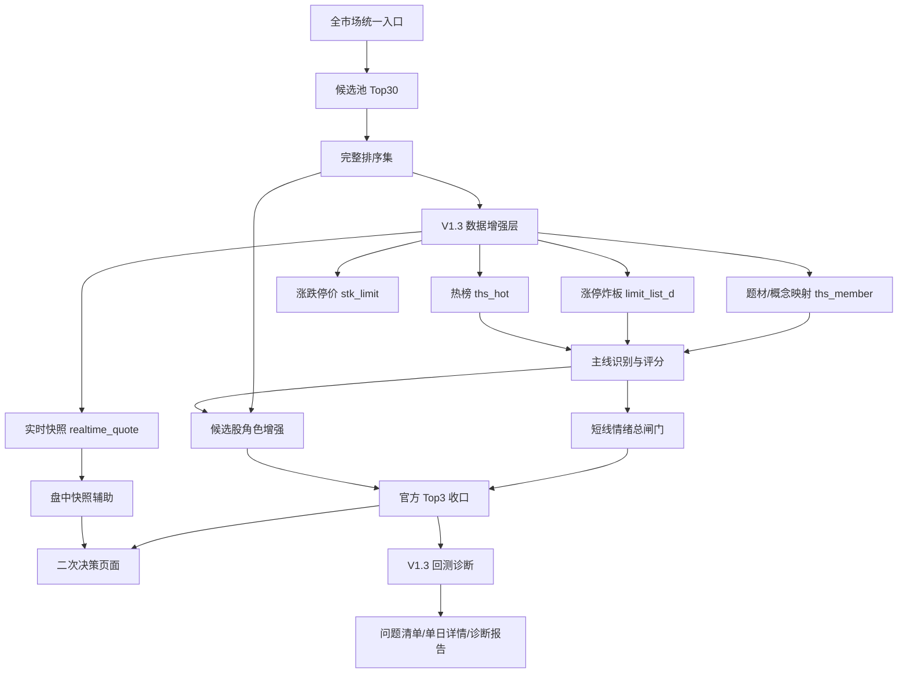

# 强势筛选 V1.3 主线增强版技术开发文档

## 1. 文档信息

- 文档名称：强势筛选 V1.3 主线增强版技术开发文档
- 英文名称：Momentum Screener V1.3 Mainline Enhancement Technical Design
- 所属系统：`daily_stock_analysis`
- 文档类型：技术开发文档 / 实现设计
- 当前状态：`draft v0.1`
- 最后更新：`2026-04-24`
- 关联文档：
  - [强势筛选 V1.3 主线增强版产品设计](./momentum-screener-v1-3-mainline-enhancement-product-design.md)
  - [强势筛选 V1.3 主线增强版开发任务清单](./momentum-screener-v1-3-development-tasks.md)
  - [强势筛选二次决策与执行辅助 SPEC](./momentum-screener-secondary-decision-spec.md)
  - [强势筛选二次决策与执行辅助技术开发文档](./momentum-screener-secondary-decision-technical-design.md)
  - [强势筛选 V1 产品原则 + 总闸门规则](./momentum-screener-v1-product-principles-and-gate-rules.md)
  - [强势筛选 V1 回测与问题诊断框架](./momentum-screener-v1-backtest-and-diagnosis-framework.md)

## 2. 目标与边界

V1.3 的技术目标是：在当前 `6000` 积分预算下，把强势筛选从“候选股排序”升级为“主线识别 + 短线情绪 + 角色收口 + 回测诊断”的稳定生产链路。

本次技术文档只定义实现方案，不直接修改业务代码。

### 2.1 本次实现范围

- 接入并标准化 `stk_limit / limit_list_d / ths_member / ths_hot / realtime_quote` 数据。
- 为候选池补充题材 / 概念映射，形成主线候选。
- 基于主线密度、涨停强度、炸板风险、热榜集中度和昨日强势反馈计算主线评分。
- 将短线情绪接入总闸门，辅助判断当天是否适合继续做强势股。
- 将官方 Top3 的选择从单股排序升级为 `单股强度 + 主线强度 + 情绪环境 + 角色地位`。
- 在回测中新增 V1.3 诊断维度，定位失败原因。
- 在页面中新增主线雷达、短线情绪、盘中快照辅助和回测诊断表达。

### 2.2 本次明确不做

- 不接入股票实时分钟线或股票历史分钟线。
- 不做分时均线 / VWAP 承接确认。
- 不做逐笔成交、Level-2、自动交易或券商下单。
- 不输出 `分钟级买点正式触发`、`分时承接已确认`、`建议买入` 等高置信度盘中交易指令。

## 3. 当前系统落点

V1.3 应优先复用当前强势筛选主链路，不新增平行产品入口。

| 层级 | 当前文件 / 模块 | V1.3 改造方向 |
| --- | --- | --- |
| API | `api/v1/endpoints/stocks.py` | 复用强势筛选、二次决策、盘中信号和回测 endpoint，扩展响应字段 |
| API Schema | `api/v1/schemas/stocks.py` | 新增主线雷达、短线情绪、快照辅助、V1.3 诊断字段 |
| 数据源 | `data_provider/tushare_fetcher.py` | 补充 6000 积分相关接口封装与标准化 |
| 筛选服务 | `src/services/momentum_screener_service.py` | 保持候选池统一入口和 Top30 官方展示 |
| 二次决策服务 | `src/services/momentum_secondary_decision_service.py` | 新增 V1.3 主线增强上下文、主线评分、情绪闸门、角色增强 |
| 回测服务 | `src/services/momentum_backtest_service.py` | 冻结 V1.3 输入快照，新增主线 / 情绪 / 角色 / 价格位置诊断 |
| 回测仓储 | `src/repositories/momentum_backtest_repo.py` | 复用现有 JSON payload 字段，必要时追加兼容字段 |
| 前端 API | `apps/dsa-web/src/api/momentumScreener.ts`、`apps/dsa-web/src/api/momentumBacktest.ts` | 扩展类型与渲染数据 |
| 前端页面 | `apps/dsa-web/src/pages/MomentumScreenerPage.tsx`、`apps/dsa-web/src/components/history/MomentumBacktestPanel.tsx` | 新增 V1.3 页面模块 |
| AI 点评 | `src/services/momentum_screener_ai_commentary_service.py` | 将 V1.3 规则结论作为解释上下文，不让 AI 覆盖规则边界 |

## 4. 总体架构



关键原则：

- 候选池入口仍固定为官方生产入口，普通用户不可调整。
- V1.3 不改变 `Standard` 官方主链路地位。
- `Aggressive` 仍是进攻补充观察层，不参与官方 Top3 最终收口。
- 主线增强基于完整排序集，不受页面展示数量变化影响。

## 5. 数据层设计

### 5.1 新增数据适配能力

优先在 `data_provider/tushare_fetcher.py` 中补齐轻量方法，服务层只依赖标准化结果，不直接拼 Tushare 原始字段。

| 能力 | 建议方法 | 关键字段 | 失败处理 |
| --- | --- | --- | --- |
| 涨跌停价 | `get_stock_limit_prices(trade_date)` | `ts_code / trade_date / up_limit / down_limit` | 缺失时追高边界降级 |
| 涨停 / 炸板 | `get_limit_list(trade_date)` | `ts_code / name / pct_chg / close / limit / status / open_times / first_time / last_time` | 缺失时短线情绪降级 |
| 题材成分 | `get_ths_members(ts_code=None, theme_code=None)` | `ts_code / con_code / name / ths_code / ths_name` | 缺失时主线识别降级为旧行业口径 |
| 热榜 | `get_ths_hot(trade_date)` | `ts_code / name / rank / hot / concept` | 缺失时热度分置中性 |
| 实时快照 | 复用 `get_realtime_quote(stock_code)` | `price / open / high / low / pre_close / time / source` | 缺失时盘中快照辅助隐藏或显示不可用 |

字段标准化要求：

- 日期统一为 `YYYY-MM-DD`。
- 股票代码统一为 `ts_code`，例如 `600519.SH`。
- 所有外部接口返回必须带 `data_source`、`data_as_of`、`is_degraded`。
- 数值字段统一转为 `float | None`，避免 `NaN / inf` 进入 API。

### 5.2 数据聚合服务

建议新增服务模块：

```text
src/services/momentum_v13_data_service.py
```

核心职责：

- 根据 `trade_date` 拉取并缓存 V1.3 所需增强数据。
- 将增强数据按股票、题材和交易日聚合。
- 为二次决策与回测提供稳定的数据快照。

建议对外方法：

```python
class MomentumV13DataService:
    def build_context(self, *, trade_date: str, ts_codes: list[str]) -> dict:
        ...

    def build_replay_context(self, *, trade_date: str, ts_codes: list[str]) -> dict:
        ...

    def get_intraday_snapshot(self, *, trade_date: str, ts_codes: list[str]) -> dict:
        ...
```

`build_context` 输出结构：

```json
{
  "trade_date": "2026-04-23",
  "data_as_of": "2026-04-23T15:30:00+08:00",
  "is_degraded": false,
  "degraded_reasons": [],
  "stock_theme_map": {},
  "theme_members": {},
  "limit_events": {},
  "limit_prices": {},
  "hot_items": [],
  "source_status": {
    "stk_limit": "ok",
    "limit_list_d": "ok",
    "ths_member": "ok",
    "ths_hot": "partial"
  }
}
```

### 5.3 缓存策略

V1.3 数据应分资源缓存，避免一次缺失拖垮全部能力。

| 缓存对象 | 建议 key | TTL / 失效策略 |
| --- | --- | --- |
| 涨跌停价 | `momentum:v13:stk_limit:{trade_date}` | 交易日级，收盘后可长期复用 |
| 涨停炸板 | `momentum:v13:limit_list:{trade_date}` | 交易日级，收盘后可长期复用 |
| 题材成分 | `momentum:v13:ths_member:{version}` | 成分变化较慢，建议 7 天或手动刷新 |
| 热榜 | `momentum:v13:ths_hot:{trade_date}` | 交易日级，盘中可短 TTL |
| 实时快照 | `momentum:v13:quote:{trade_date}:{ts_code}` | 盘中 30-60 秒，收盘后不作为正式回测输入 |
| 聚合上下文 | `momentum:v13:context:{trade_date}:{hash(ts_codes)}` | 依赖上游资源版本 |

第一版优先使用现有磁盘 / 内存缓存能力；如后续切 Redis，应保持 key 语义不变。

### 5.4 降级策略

| 缺失数据 | 降级结果 | 页面表达 |
| --- | --- | --- |
| `ths_member` 缺失 | 主线识别回退到旧行业 / 主题文本口径 | `主线识别降级：题材成分不可用` |
| `limit_list_d` 缺失 | 短线情绪不计算涨停 / 炸板维度 | `短线情绪低置信度` |
| `stk_limit` 缺失 | 不计算涨跌停边界和追高红线 | `追高边界不可用` |
| `ths_hot` 缺失 | 热榜集中度置中性 | `热榜数据缺失，不作为扣分` |
| `realtime_quote` 缺失 | 盘中快照辅助不可用 | `暂无实时快照，等待刷新` |

降级时禁止把 `None` 当作 `0` 扣死，必须通过 `is_degraded` 和 `confidence` 表达。

## 6. 规则服务设计

### 6.1 主线识别

建议在 `MomentumSecondaryDecisionService` 内新增独立构建函数，避免污染旧评分路径：

```python
def _build_v13_mainline_context(
    self,
    *,
    candidates: list[dict],
    v13_data: dict,
) -> dict:
    ...
```

主线识别流程：

```text
候选股
-> 股票题材映射
-> 题材候选池聚合
-> 题材强势密度计算
-> 题材涨停 / 炸板 / 热榜证据计算
-> 主线评分
-> 输出 Top 1-2 条主线
```

主线评分建议第一版采用可解释加权：

| 维度 | 权重 | 说明 |
| --- | --- | --- |
| 候选池密度 | 30 | 题材在候选池 Top30 / Top10 中的占比 |
| 涨停强度 | 25 | 题材内涨停数、连板高度、涨停质量 |
| 炸板风险 | -15 | 题材内炸板率、开板次数、冲高回落 |
| 热榜集中度 | 15 | 热门股 / 热门题材是否集中在该主线 |
| 昨日强势反馈 | 25 | 昨日候选池 Top10 + 昨日官方 Top3 次日表现 |

输出档位：

| 分数 | 档位 |
| --- | --- |
| `>= 80` | `extreme` / 主线极强 |
| `65-79` | `confirmed` / 主线成立 |
| `50-64` | `uncertain` / 主线存疑 |
| `< 50` | `weak` / 主线过弱 |

### 6.2 短线情绪总闸门

建议新增函数：

```python
def _build_v13_short_term_sentiment(
    self,
    *,
    mainlines: list[dict],
    v13_data: dict,
    previous_feedback: dict,
) -> dict:
    ...
```

输入：

- 全市场涨停数量。
- 全市场炸板率。
- 连板高度。
- 主线内涨停与炸板表现。
- 昨日候选池 Top10 表现。
- 昨日官方 Top3 表现。
- 热榜集中度。

输出结构：

```json
{
  "level": "hot",
  "label": "高涨",
  "score": 82,
  "summary": "涨停扩散、炸板可控，昨日强势反馈良好。",
  "modules": [
    {"key": "limit_strength", "label": "涨停强度", "level": "strong", "score": 86},
    {"key": "break_risk", "label": "炸板风险", "level": "medium", "score": 68}
  ],
  "confidence": "medium",
  "is_degraded": false
}
```

总闸门接入规则：

- `高涨`：允许总闸门上调一档，但不得绕过买点和风险边界。
- `可做`：保持原结论。
- `分歧`：限制强信任表达，最高优先收口到谨慎或观察。
- `退潮`：除非主线和机会质量极强，否则最高只保留观察。

### 6.3 角色增强

角色识别在旧逻辑基础上增加主线证据。

| 角色 | 新增判断 |
| --- | --- |
| 龙头核心 | 所属主线强度、题材内地位、是否带动同题材扩散、昨日强势反馈 |
| 前排换手 | 主线内排序、换手健康度、涨停 / 炸板 / 回封结构、非后排跟风 |
| 观察备选 | 主线确认、补涨潜力、风向标价值，不用于凑数 |

候选股内部建议新增中间字段：

```json
{
  "mainline_id": "theme_001",
  "mainline_name": "机器人",
  "mainline_score": 78.5,
  "theme_rank": 2,
  "role_evidence": ["主线成立", "题材内成交额前排", "昨日反馈强"],
  "v13_role_score": 74.0
}
```

### 6.4 官方 Top3 收口

V1.3 仍从完整排序集收口，不从页面当前 TopN 截断结果收口。

建议主仓优先级：

```text
买点清晰度
-> 主线强度
-> 角色地位
-> 单股 rank_score
-> 价格位置与追高风险
```

建议次仓优先级：

```text
同主线前排补强
-> 进攻弹性
-> 风险可控
-> 与主仓角色不完全重复
```

建议观察仓优先级：

```text
主线确认价值
-> 风向标价值
-> 补涨潜力
-> 价格位置安全
```

不满足质量时继续允许输出 `1-2` 只，不强凑 `3` 只。

### 6.5 盘中快照辅助

盘中快照辅助只用来判断：

- 当前价格是否接近观察区。
- 当前价格是否偏离过大。
- 当前是否触及涨停 / 跌停边界。
- 当前主线热榜是否仍有关注度。

输出结构：

```json
{
  "snapshot_assist": {
    "label": "盘中快照辅助",
    "confidence": "low",
    "data_as_of": "2026-04-24T10:30:00+08:00",
    "overall_label": "继续观察",
    "items": [
      {
        "slot": "main",
        "ts_code": "601016.SH",
        "price": 4.52,
        "status": "near_zone",
        "status_label": "接近观察区",
        "reason": "价格接近计划区，但缺少分钟级承接确认。",
        "missing_conditions": ["需要人工确认分时承接"]
      }
    ]
  }
}
```

文案护栏：

- 允许：`接近观察区`、`偏离过大`、`等待人工确认分时承接`。
- 禁止：`买点已确认`、`建议买入`、`分时承接成立`。

## 7. API 与 Schema 设计

### 7.1 Endpoint 策略

第一版不新增独立入口，复用现有 endpoint：

| Endpoint | V1.3 改造 |
| --- | --- |
| `POST /api/v1/stocks/screener/momentum` | 返回候选池时可附带 `entry_baseline_version / market_scope_version` |
| `POST /api/v1/stocks/screener/momentum/secondary-decision` | 返回 V1.3 主线增强字段 |
| `POST /api/v1/stocks/screener/momentum/intraday-signal` | 返回 `snapshot_assist`，并明确低置信度 |
| `POST /api/v1/stocks/screener/momentum/backtest` | 创建回测时默认走 Standard 官方链路，并冻结 V1.3 增强数据 |
| `GET /api/v1/stocks/screener/momentum/backtest/{run_id}/summary` | 返回 V1.3 诊断汇总 |
| `GET /api/v1/stocks/screener/momentum/backtest/{run_id}/daily/{trade_date}` | 返回单日 V1.3 输入、结论和失败归因 |

### 7.2 建议新增 Schema

建议在 `api/v1/schemas/stocks.py` 中新增或扩展以下模型：

```python
class MomentumMainlineEvidence(BaseModel):
    key: str
    label: str
    level: str
    score: float
    summary: str

class MomentumMainlineRadarItem(BaseModel):
    theme_id: str
    theme_name: str
    score: float
    level: str
    level_label: str
    candidate_count: int
    top10_count: int
    limit_up_count: int
    broken_limit_count: int
    hot_rank: Optional[int] = None
    representatives: list[MomentumDecisionThemeRepresentative]
    evidence: list[MomentumMainlineEvidence]
    is_degraded: bool = False
    degraded_reasons: list[str] = []

class MomentumShortTermSentiment(BaseModel):
    level: str
    label: str
    score: float
    summary: str
    modules: list[MomentumDecisionGateModule]
    confidence: str
    is_degraded: bool = False
    degraded_reasons: list[str] = []

class MomentumSnapshotAssist(BaseModel):
    label: str
    confidence: str
    data_as_of: Optional[str] = None
    overall_label: str
    summary: str
    items: list[dict] = []
```

`MomentumSecondaryDecision` 建议追加字段：

```python
mainline_radar: list[MomentumMainlineRadarItem] = []
short_term_sentiment: Optional[MomentumShortTermSentiment] = None
v13_data_status: dict = {}
```

`MomentumSecondaryDecisionIntradayResponse` 建议追加字段：

```python
snapshot_assist: Optional[MomentumSnapshotAssist] = None
```

### 7.3 兼容性

- 只追加字段，不删除旧字段。
- 前端缺省时继续按 V1 页面渲染。
- `v13_data_status.is_degraded=true` 时，页面必须展示降级原因。
- AI 点评请求中的 `screening_data` 可带 V1.3 字段，但 prompt 必须先遵守规则结论。

## 8. 回测设计

### 8.1 回测输入冻结

回测每个交易日应冻结以下输入：

- 候选池完整排序集。
- V1.3 增强数据上下文。
- 主线雷达结果。
- 短线情绪结论。
- 官方 Top3 组合。
- 价格位置与追高边界。
- T+1 / T+2 结果。

建议在已有 candidate / decision / daily summary JSON payload 中追加 V1.3 快照，避免第一版新增大量表结构。

### 8.2 新增诊断维度

回测 summary 新增 V1.3 诊断：

| 诊断项 | 说明 |
| --- | --- |
| `mainline_quality` | 官方 Top3 是否集中在强主线 |
| `theme_concentration` | 是否主线过散或题材归因混乱 |
| `sentiment_alignment` | 短线情绪是否支持出手 |
| `role_fit` | 主仓 / 次仓 / 观察仓角色是否合理 |
| `price_position` | 失败是否来自追高、偏离过大或空间不足 |
| `candidate_pool_bias` | 候选池入口是否漏掉真正强票 |

### 8.3 新增比较基准

回测至少保留以下比较：

- 官方 Top3。
- 候选池 Top10。
- 原始 rank Top3。
- 主仓基准。
- 同主线 Top3。
- 非主线高分股。

V1.3 判断有效的方向不是“每天都提高收益”，而是：

- 官方 Top3 相比原始 rank Top3 的风险更低。
- 主线内强票命中率更高。
- 在退潮和分歧日更少误出手。
- 失败归因能解释大部分亏损日。

### 8.4 严格回测与生产回测

| 口径 | 用途 | 说明 |
| --- | --- | --- |
| 生产回测 | 看当前页面链路表现 | 可复用缓存和已有代理结果 |
| 严格 V1.3 回测 | 验证新规则是否真实有效 | 必须逐日冻结当时可用数据，不能使用未来数据 |

严格回测要求：

- `ths_member` 成分若无法回放历史版本，第一版必须标注为当前成分近似。
- `ths_hot` 若没有历史稳定数据，不能参与严格高权重评分。
- `realtime_quote` 不进入严格历史买点结论，只能验证快照辅助逻辑。

## 9. 前端设计

### 9.1 页面模块

在 `apps/dsa-web/src/pages/MomentumScreenerPage.tsx` 中新增模块，优先复用现有视觉语言。

建议组件拆分：

```text
apps/dsa-web/src/components/screener/
  MainlineRadarPanel.tsx
  ShortTermSentimentCard.tsx
  SnapshotAssistPanel.tsx
  V13DataStatusBadge.tsx
```

页面结构建议：

```text
筛选参数说明
-> 统计卡片
-> 二次决策
   -> 今日出手级别
   -> 主线雷达
   -> 短线情绪
   -> 官方 Top3
   -> 落选说明
   -> 盘中快照辅助
-> Aggressive 折叠补充层
```

### 9.2 回测页面

在 `apps/dsa-web/src/components/history/MomentumBacktestPanel.tsx` 中新增：

- V1.3 诊断总览。
- 主线质量分布。
- 情绪分布。
- 失败归因 TopN。
- 单日详情中的 `主线 / 情绪 / 角色 / 价格位置` 分解。

### 9.3 前端类型

在以下文件同步追加类型：

- `apps/dsa-web/src/types/momentumScreener.ts`
- `apps/dsa-web/src/types/momentumBacktest.ts`

前端必须容忍字段不存在：

- 老后端返回时不崩溃。
- V1.3 数据降级时显示状态，而不是空白。
- 所有分数和百分比通过统一格式化函数处理 `null`。

## 10. AI 点评设计

V1.3 接入 AI 点评时，AI 只做解释和追问，不做规则覆盖。

Prompt 上下文新增：

```json
{
  "v13_context": {
    "mainline_radar": [],
    "short_term_sentiment": {},
    "snapshot_assist": {},
    "data_status": {}
  },
  "guardrails": [
    "不得输出建议买入",
    "不得把快照辅助说成分钟级买点",
    "必须先复述规则结论，再解释原因"
  ]
}
```

AI 输出优先解释：

1. 今天主线是否清晰。
2. 官方 Top3 为什么属于这些角色。
3. 当前总闸门为什么允许 / 限制出手。
4. 盘中快照只能说明什么、不能说明什么。
5. 用户还需要人工确认哪些条件。

## 11. 性能与稳定性

### 11.1 性能目标

| 场景 | 目标 |
| --- | --- |
| 收盘后二次决策首次计算 | 尽量控制在 `30-60` 秒内，允许后台补齐 |
| 缓存命中后二次决策 | `5` 秒内返回 |
| 盘中快照辅助 | `3-10` 秒内返回 |
| 60 交易日回测 | 后台串行执行，页面可刷新进度 |

### 11.2 稳定性要求

- 单个增强接口失败不能导致强势筛选主链路失败。
- 所有增强字段必须可降级。
- 回测任务继续保持串行模式，避免并发任务压垮 Tushare 配额。
- 长任务必须持续更新阶段和进度，页面刷新能看到任务仍在运行。
- 缓存 key 必须包含 `trade_date`、资源名和必要参数，避免跨日期污染。

## 12. 配置与部署

第一版不强制新增环境变量，优先复用：

- `TUSHARE_TOKEN`
- 现有数据源优先级配置
- 现有 API timeout 配置
- 现有回测任务仓储与 Docker 部署方式

如后续需要新增配置，必须同步更新 `.env.example` 和相关文档：

- `MOMENTUM_V13_CACHE_TTL_SECONDS`
- `MOMENTUM_V13_ENABLE_THS_HOT`
- `MOMENTUM_V13_ENABLE_INTRADAY_SNAPSHOT`

## 13. 测试计划

### 13.1 后端单元测试

建议新增或扩展：

- `tests/test_momentum_secondary_decision_service.py`
- `tests/test_momentum_backtest_service.py`
- `tests/test_momentum_screener_api.py`

必须覆盖：

- 题材成分缺失时主线降级。
- 涨停炸板缺失时情绪降级。
- 热榜缺失不误扣分。
- 官方 Top3 不受页面 TopN 影响。
- `snapshot_assist` 不输出高置信度买入表达。
- 回测 summary 能输出 V1.3 诊断字段。

### 13.2 前端测试

建议覆盖：

- V1.3 字段完整时模块正常展示。
- V1.3 字段缺失时页面不崩溃。
- 降级状态可见。
- 回测任务刷新能看到进度变化。
- AI 点评中规则结论优先展示。

### 13.3 手工验收

至少验证以下路径：

1. 进入强势筛选页，执行官方筛选。
2. 查看主线雷达是否能解释官方 Top3。
3. 查看短线情绪是否能影响今日出手级别。
4. 切换到盘中快照辅助，确认只显示低置信度提示。
5. 创建 60 交易日回测，等待完成后查看 V1.3 诊断。
6. 打开 AI 点评，确认 AI 不覆盖规则结论。

## 14. 开发实施顺序

### 14.1 第一阶段：数据层

- 在 `TushareFetcher` 中补齐 V1.3 接口封装。
- 新增 `MomentumV13DataService`。
- 完成资源级缓存和降级状态。
- 补数据层单元测试。

### 14.2 第二阶段：规则层

- 在二次决策服务中新增 V1.3 上下文构建。
- 新增主线评分、短线情绪和角色增强。
- 将 V1.3 结果接入官方 Top3 收口。
- 补二次决策单元测试。

### 14.3 第三阶段：API 与前端

- 扩展 schema 和 TypeScript 类型。
- 新增主线雷达、短线情绪、盘中快照辅助模块。
- 保持旧字段兼容。
- 补前端构建和页面回归。

### 14.4 第四阶段：回测诊断

- 回测冻结 V1.3 上下文。
- summary 新增 V1.3 诊断。
- daily detail 新增单日失败归因。
- 跑 60 交易日回测并输出诊断报告。

### 14.5 第五阶段：AI 点评

- 将 V1.3 上下文纳入 AI prompt。
- 增加 guardrail。
- 验证 AI 不输出越界交易指令。

## 15. 验收标准

V1.3 技术实现完成后，应满足：

- 页面能展示 `主线雷达 / 短线情绪 / 官方 Top3 / 盘中快照辅助`。
- 任一 V1.3 数据源不可用时，主链路仍可返回，并显示降级原因。
- 官方 Top3 的主仓 / 次仓 / 观察仓选择不受页面展示数量影响。
- 回测能输出 V1.3 失败归因，而不是只给收益统计。
- AI 点评能解释 V1.3 规则结果，但不能覆盖规则结论。
- 60 交易日回测报告能回答：主线识别是否有效、短线情绪是否有过滤价值、官方 Top3 是否优于原始排序。

## 16. 风险与回滚

### 16.1 主要风险

- Tushare 增强接口权限或字段与预期不一致。
- `ths_member` 当前成分无法严格还原历史，影响历史回测准确性。
- `ths_hot` 历史可用性不足，不能作为严格高权重依据。
- 规则权重过早复杂化，导致回测不好解释。
- 盘中快照被用户误解为分钟级买点。

### 16.2 回滚方式

- API 保持追加字段，回滚时前端隐藏 V1.3 模块即可。
- 后端可通过服务内开关禁用 V1.3 上下文构建，回退到 V1 二次决策。
- 回测保留旧 summary 字段，V1.3 诊断字段为空时页面展示“未启用 V1.3 诊断”。
- AI prompt 可移除 `v13_context`，回退到原二次决策解释。
