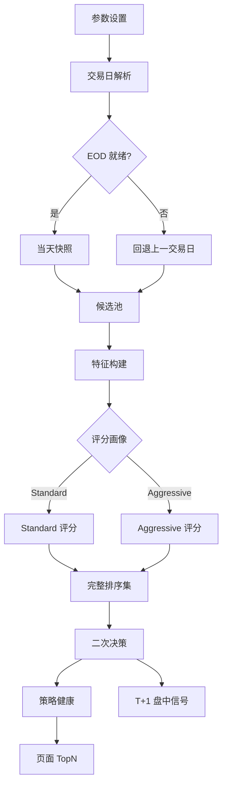
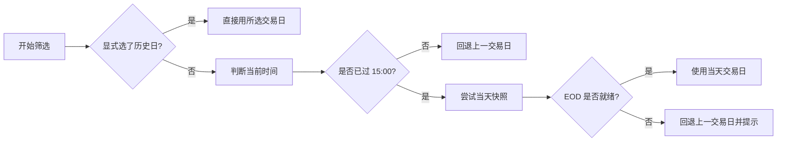
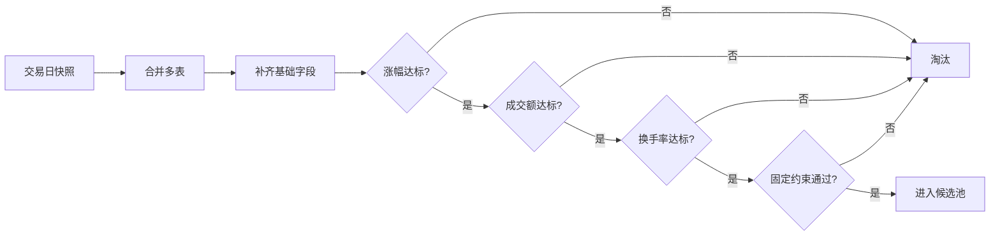
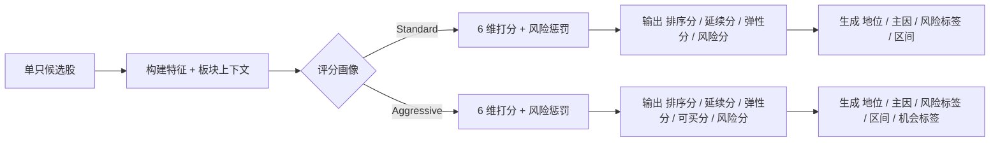
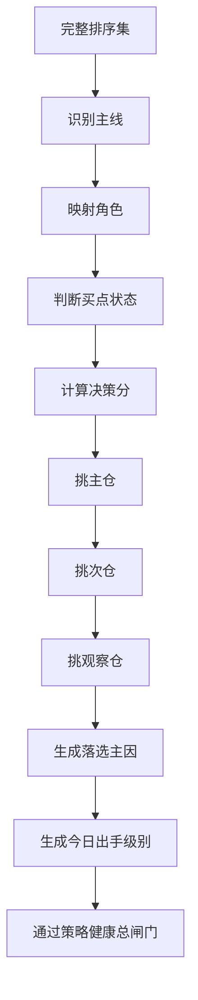
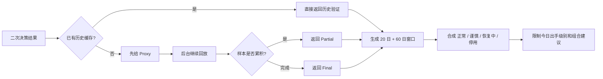
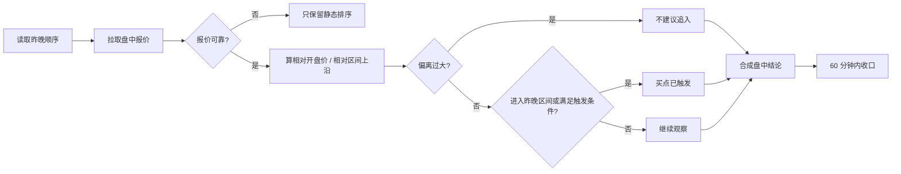

# 强势筛选执行逻辑说明（Beta）

本文面向已经开始使用或准备使用 `强势筛选` 的用户。
目标不是教你写代码，而是让你完整理解这个功能到底是怎么跑出来的、每一步在筛什么、为什么最后会给出这样的结果。

如果你只记一件事，请记住这句话：

> 强势筛选不是“盘中追涨提醒器”，而是一个 **T 日收盘后，为 T+1 做准备的强势股筛选与二次决策系统**。

---

## 1. 它到底在解决什么问题

强势筛选解决的是下面这条链路里的前半段问题：

1. T 日收盘后，从全市场里找出当天真正强势的股票
2. 从强势候选里，继续收口成 1-3 只最值得盯的票
3. 告诉你次日该不该做、优先盯谁、买点大概在哪、为什么没选别的票
4. 到 T+1 盘中，再根据昨晚固定顺序给出“继续观察 / 买点触发 / 不建议追”的执行辅助

它不直接替你做这些事：

1. 自动下单
2. 自动分配仓位
3. 自动止盈止损
4. 完整接管卖出系统

换句话说，它的定位是：

- **基础筛选**：把强势股先筛出来、排好序
- **二次决策**：把“候选池”收口成“主线 + 主仓 / 次仓 / 观察仓 + 明日执行提示”
- **盘中信号**：沿用昨晚固定顺序，判断有没有出现更清晰的买点触发

---

## 2. 整体执行总览



这条链路里最容易误解的地方有 3 个：

1. `候选池数量` 是通过硬过滤后进入评分池的股票数，不是最终建议数
2. `结果数量` 只是页面当前展示的 TopN，不决定二次决策本身
3. 二次决策不是直接从页面 TopN 里挑，而是从 **完整排序集** 里做主线和组合收口

更准确地说，当前系统的主路径是：

`交易日解析 -> 交易日快照 -> 候选池 -> 全量评分排序 -> 二次决策 -> 页面展示 TopN -> 次日盘中信号`

---

## 3. 第一步：交易日解析与 EOD 就绪判定

### 3.1 这一步要解决什么

它要先回答一个很基础但很重要的问题：

> 这次筛选到底应该用哪一天的数据来跑？

因为你看到的页面时间，不一定等于后台已经拿到完整收盘批量数据的时间。

### 3.2 执行流程图



### 3.3 当前判定规则

当前 beta 里，交易日的默认解析规则是：

1. 如果你显式选择的是一个历史交易日，系统直接按那个交易日取数据
2. 如果你留空，系统会在 **15:00 之后优先尝试当天**
3. 如果当天 `EOD` 批量数据还没同步完成，系统会自动回退到上一交易日
4. 如果你显式选择的是“今天”，但当天 EOD 还没就绪，也会先回退到上一交易日，并给出解释提示

### 3.4 什么叫“EOD 已就绪”

当前系统并不是单纯看“现在几点了”，而是看当天快照是否真的可用。

当前快照至少包含这些表：

1. `stock_basic`
2. `daily`
3. `daily_basic`
4. `moneyflow`
5. `stk_limit`
6. `top_list`

其中，是否可用于正式筛选，关键看：

1. `daily` 不能是空
2. `daily_basic` 不能是空
3. `daily` 和 `daily_basic` 的覆盖率至少达到预期样本量的 `60%`

如果达不到，系统宁愿回退上一交易日，也不会硬拿一份半残数据去筛。

### 3.5 页面上你会看到什么

这一步对应页面里的 3 个字段：

1. `requested_trade_date`
   含义：你原本想看的日期
2. `trade_date`
   含义：本次真正用于筛选的日期
3. `trade_date_note`
   含义：如果发生回退，会告诉你原因

例如：

- `2026-04-14 收盘数据尚未同步完成，当前自动使用上一交易日 2026-04-13。`

---

## 4. 第二步：交易日快照与候选池硬过滤

### 4.1 这一步在干什么

这一步的目标非常直接：

> 先不要讨论谁最强，先把“根本不该进入强势评分池”的股票排除掉。

所以这一层不是“精细决策”，而是“硬门槛过滤”。

### 4.2 执行流程图



### 4.3 当前硬过滤条件

候选池的过滤条件本质上就是 3 个用户参数 + 2 个系统固定约束。

用户参数：

1. `pct_chg >= 最小涨幅`
2. `amount >= 最小成交额`
3. `turnover_rate >= 最小换手率`

系统固定约束：

1. `exclude_st = True`
   含义：`ST` 股票不进入候选池
2. `main_board_only = True`
   含义：只保留主板代码

### 4.4 这里的 2 个数量一定要分清

#### `候选池数量`

含义：通过硬过滤后，进入“评分池”的股票数。

它回答的问题是：

> 今天有多少只股票，至少满足了“可以拿来做强势评分”的最低门槛？

#### `结果数量`

含义：当前页面展示出来的 `TopN` 数量。

它回答的问题是：

> 排序完以后，这一页准备展示多少只给你看？

这两个数字经常被混淆，但它们不是一回事：

- `候选池数量` 决定评分输入规模
- `结果数量` 只决定展示和导出规模

---

## 5. 第三步：特征构建与两套评分引擎

### 5.1 这一步在干什么

进入候选池以后，系统才开始做真正的“强弱判断”。

它会先为每只股票构建一组特征，例如：

1. 当日开高低收位置
2. 相对涨停价的接近程度
3. 近 3 日 / 5 日累计涨幅
4. 成交额、换手率、量比
5. 主力净流入和在全池里的相对分位
6. 近 20 日高点、5 日均线
7. 板块里有多少强势股、多少涨停、谁是龙头、自己排第几

然后再根据你选择的画像，走两条不同的评分路径。

### 5.2 评分分支流程图



### 5.3 Standard 引擎在看什么

`Standard` 更偏“稳一点的强势确认”。

它的 6 个维度是：

| 维度 | 满分 | 含义 |
| --- | ---: | --- |
| `strength_confirmation` | 20 | 今天到底强不强，收得够不够硬 |
| `volume_price_structure` | 20 | 量价结构是否健康 |
| `trend_position` | 15 | 当前处在什么趋势位置 |
| `sector_resonance` | 20 | 所属板块是否共振 |
| `capital_support` | 15 | 资金是否承接 |
| `elasticity_activity` | 10 | 股性、弹性、活跃度是否合适 |
| `risk_penalty` | 20 | 如果有透支、上影、退潮等风险，要扣分 |

#### Standard 总分公式

```text
base_score = 6 个正向维度得分之和
final_score = max(0, base_score - risk_penalty)

continuation_score =
  (strength_confirmation / 20) * 0.30
  + (volume_price_structure / 20) * 0.30
  + (sector_resonance / 20) * 0.25
  + (capital_support / 15) * 0.15

extension_score =
  (trend_position / 15) * 0.40
  + (sector_resonance / 20) * 0.30
  + (elasticity_activity / 10) * 0.30

risk_score = (risk_penalty / 20) * 100

rank_score =
  continuation_score * 0.65
  + extension_score * 0.25
  - risk_score * 0.10
```

#### Standard 会输出什么

1. `final_score`
   含义：原始总分，偏“综合强度”
2. `continuation_score`
   含义：这只票明天继续强的概率和质量
3. `extension_score`
   含义：这只票的弹性和延伸空间
4. `risk_score`
   含义：风险惩罚折算成百分制后的风险分
5. `rank_score`
   含义：最终排序最核心的字段

#### Standard 的买入区间怎么来

当前 beta 里，`Standard` 也会生成明确的次日买入区间。

它锚定的是 **筛选交易日当天的 `open / close / ma5 / prev_20d_high`**，不是前一天。

如果股票在所属主线里属于 `leader_rank <= 2` 的龙头型个股：

```text
total_width_ratio = 2%
half_width_ratio = 1%
```

否则：

```text
total_width_ratio = 3%
half_width_ratio = 1.5%
```

再按下面的逻辑收口：

```text
support_floor =
  max(
    close * (1 - half_width_ratio),
    min(open, close),
    ma5 * 修正系数
  )

confirm_ceiling =
  close * (1 + half_width_ratio)

如果 close 已经很接近 prev_20d_high：
  confirm_ceiling 会再被 prev_20d_high 的突破确认位收紧
```

一句话理解：

- 龙头型 `Standard` 更偏“围绕昨收附近做强确认”
- 非龙头型 `Standard` 区间会略宽一些，容纳更多回踩与确认空间

### 5.4 Aggressive 引擎在看什么

`Aggressive` 更偏“攻击性、可参与性和次日可下手度”。

它的 6 个维度是：

| 维度 | 满分 | 含义 |
| --- | ---: | --- |
| `strength_confirmation` | 30 | 是否接近涨停、是否高开强、是否加速 |
| `capital_support` | 20 | 主力资金有没有明显支持 |
| `buyability` | 15 | 明天好不好下手，盈亏比是否合适 |
| `volume_price_track` | 15 | 量价轨道是否顺 |
| `sector_resonance` | 12 | 板块共振强不强 |
| `trend_elasticity` | 8 | 趋势位置与弹性 |
| `risk_penalty` | 15 | 过热、背离、退潮等风险扣分 |

#### Aggressive 总分公式

```text
base_score = 6 个正向维度得分之和
final_score = max(0, base_score - risk_penalty)

continuation_score =
  (strength_confirmation / 30) * 0.35
  + (capital_support / 20) * 0.25
  + (volume_price_track / 15) * 0.20
  + (sector_resonance / 12) * 0.10
  + (trend_elasticity / 8) * 0.10

extension_score =
  (strength_confirmation / 30) * 0.25
  + (sector_resonance / 12) * 0.20
  + (trend_elasticity / 8) * 0.30
  + (buyability / 15) * 0.25

buyability_score =
  (buyability / 15) * 0.50
  + (volume_price_track / 15) * 0.30
  + (capital_support / 20) * 0.20

risk_score = (risk_penalty / 15) * 100

rank_score =
  continuation_score * 0.55
  + buyability_score * 0.25
  + extension_score * 0.20
  - risk_score * 0.12
```

#### Aggressive 的买入区间怎么来

`Aggressive` 的区间更直接，围绕筛选日 K 线实体与收盘强度来给：

```text
entry_low = max(close * 0.985, min(open, close))
entry_high = close * 1.015
```

一句话理解：

- `Aggressive` 更强调“明天是否容易参与”
- 所以它天然会更关注 `buyability_score`

### 5.5 龙头等级是怎么划分的

每只票在所属主线内部会拿到一个 `leader_rank`，再映射成页面上的 `leader_level`。

当前规则：

1. `rank <= 2` -> `龙头`
2. `rank <= 5` -> `前排`
3. `rank <= 10` -> `中位`
4. 其他 -> `后排`

### 5.6 `top_reasons` 和 `risk_tags` 是怎么来的

#### `top_reasons`

系统会把打分维度中，**得分占本维度满分比例 >= 70%** 的维度拿出来，按分数从高到低取前 3 个。

它回答的问题是：

> 这只票为什么会强？

例如可能出现：

1. `强势确认`
2. `量价结构`
3. `板块共振`

#### `risk_tags`

风险分不是一句空话，而是由具体风险条件触发的。

当前常见风险包括：

1. `upper_shadow`
   含义：长上影、冲高回落
2. `blowoff_volume`
   含义：爆量滞涨、放量分歧、高量透支
3. `late_session_weakness`
   含义：尾盘走弱
4. `high_acceleration`
   含义：短期连续加速后透支
5. `price_flow_divergence`
   含义：涨幅很高但资金净流入不配合
6. `sector_fade`
   含义：板块跟随太弱，只有它一只在强
7. `top_list_distribution`
   含义：龙虎榜更多在兑现，不是净流入

---

## 6. 第四步：全量排序与页面 TopN

评分完成后，系统先得到的是一个 **完整排序集**。

页面常见排序字段包括：

1. `rank_score`
2. `continuation_score`
3. `extension_score`
4. `risk_score`
5. `buyability_score`（仅 Aggressive 更重要）

### 6.1 这一层要记住的核心原则

```text
候选池 -> 全量评分排序 -> 二次决策 -> 页面展示 TopN
```

也就是说：

1. 二次决策依赖的是“完整排序集”
2. 页面 `TopN` 只是把其中一部分展示给你看
3. 只改 `返回数量`，本质上不应该改变主仓 / 次仓 / 观察仓的逻辑来源

### 6.2 页面上 4 个摘要卡片是什么意思

| 卡片 | 含义 |
| --- | --- |
| `候选池数量` | 通过硬过滤进入评分池的股票数 |
| `结果数量` | 当前页面展示的 TopN 数量 |
| `平均排序分` | 当前页面结果列表的 `rank_score` 平均值 |
| `最高排序分` | 当前第 1 名的 `rank_score` 以及它是谁 |

---

## 7. 第五步：二次决策如何从“强势结果”收口成可执行组合

### 7.1 这一步在干什么

如果说基础筛选回答的是：

> 今天哪些票值得进入强势观察名单？

那么二次决策回答的就是：

> 这些票里谁更像主线核心，谁更值得优先盯，今天到底该不该做？

### 7.2 二次决策流程图



### 7.3 主线识别是怎么算的

系统会先把完整排序集按 `theme` 分组，然后给每个主题算一个 `theme_score`。

当前公式：

```text
theme_score =
  min(
    100,
    avg_rank_score * 0.60
    + min(主题内股票数, 3) * 7
    + leader_count * 6
    + front_count * 3
    + clear_count * 4
  )
```

它背后的含义是：

1. 主题里平均排序分高不高
2. 这个主题是不是只强一只，还是前排密度够
3. 是否有龙头、有前排、有清晰买点

最后只保留前 2 条主线主题进入二次决策展示。

### 7.4 每只票的“角色”是怎么来的

角色本身不是人工指定，而是根据 `leader_level` 映射：

1. `龙头` -> `龙头核心`
2. `前排` -> `前排换手`
3. `中位` -> `观察备选`
4. `后排` -> `观察备选`

### 7.5 每只票的“买点状态”怎么判断

#### Aggressive 的买点判定

```text
如果 buyability_score >= 72
  且 risk_score <= 35
  且 已生成买入区间
=> 买点清晰

否则如果 buyability_score >= 60
  且 rank_score >= 65
  且 risk_score <= 55
=> 等待触发

否则
=> 买点不清晰
```

#### Standard 的买点判定

```text
如果 role == 龙头核心
  且 continuation_score >= 82
  且 rank_score >= 70
  且 risk_score <= 40
  且 已生成买入区间
=> 买点清晰

否则如果 continuation_score >= 72
  且 rank_score >= 60
  且 risk_score <= 55
=> 等待触发

否则
=> 买点不清晰
```

这也是为什么现在的二次决策不会再出现：

> 页面写“买点清晰”，但买入区间却是 `--`

因为当前实现里，“买点清晰”必须建立在区间已经生成的前提上。

### 7.6 每只票的决策分怎么来

系统先给每只票算一个 `_decision_score`，再作为后面主仓 / 次仓 / 观察仓挑选的基础。

当前公式：

```text
decision_score =
  rank_score * 0.55
  + continuation_score * 0.20
  + (buyability_score 或 extension_score) * 0.15
  + role_priority
  + buy_point_priority
  - risk_score * 0.10
```

其中：

1. `role_priority`
   - 龙头核心：`12`
   - 前排换手：`8`
   - 观察备选（中位）：`3`
   - 观察备选（后排）：`0`
2. `buy_point_priority`
   - 买点清晰：`12`
   - 等待触发：`5`
   - 买点不清晰：`0`

### 7.7 主仓 / 次仓 / 观察仓是怎么选出来的

系统并不是“谁分高谁全包”，而是按角色和主线结构来挑。

#### 主仓

优先从 `买点清晰` 的票里选 `portfolio_priority` 最高的。

`portfolio_priority` 当前公式：

```text
portfolio_priority =
  decision_score
  + theme_score * 0.18
  + role_priority
  + buy_point_priority
  - risk_score * 0.08
```

补充口径：

1. 如果当前主仓还是 `waiting`，而同主线里已经有 `leader + clear` 的票进入默认组合，系统会做一次“主仓纠偏”。
2. 这次纠偏不是无脑把龙头抬上去，而是只在当前主仓没有明显更强的前瞻优势时，才把主仓切回更清晰的主线核心。
3. 如果当前主仓本身虽然不是 `clear`，但 `forward_alpha_score` 明显更高，系统仍允许它继续留在主仓。

#### 次仓

次仓会优先考虑两类情况：

1. 如果第二主线足够接近第一主线，优先跨主线分配，做组合平衡
2. 如果第一主线明显更强，则优先在主线内部做角色互补

补充口径：

1. 当主仓还没有 `clear` 时，次仓会优先补一只“同主线确认票”，避免默认组合看起来很多元，但主线确认反而不够。
2. 只有当第二主线真的接近、且跨主线候选明显不弱时，系统才会优先做跨主线平衡。

#### 观察仓

观察仓不是凑数，而是：

1. 保留一个还值得看、但还不到直接执行的观察位
2. 继续监控主线确认票或备选票

如果没有合适的观察仓，系统也可以不凑满 3 只。

### 7.8 落选说明怎么来

未入选股票不会只显示“没选上”，而是给出一个主淘汰原因。

当前优先顺序是：

1. `非主线 / 主线过弱`
2. `买点不清晰`
3. `角色重复`
4. `主线内名次不够`
5. `近期验证偏弱`

### 7.9 今日出手级别怎么判断

补充口径：
当市场环境整体仍是 `medium`，但核心溢价或广度溢价至少一项仍为 `strong`，并且主仓盈亏比过线、组合里已经出现至少 1 只明确计划买点时，V1 不再机械停留在“仅观察”，而是允许把基础动作矩阵上调到“谨慎出手”，减少明显错杀。

在还没有考虑策略健康总闸门之前，系统会先按主题强度、可执行票数量和平均风险给一个初始动作级别。

当前初始规则：

```text
ready_count >= 3 且 top_theme_score >= 78 -> 强烈可做
ready_count >= 2 且 top_theme_score >= 68 -> 可正常出手
ready_count >= 1 且 top_theme_score >= 58 -> 谨慎出手
top_theme_score >= 55 -> 仅观察
否则 -> 今日不做
```

然后还有两层修正：

1. 如果组合平均风险分 `avg_risk >= 45`
   - `强烈可做 / 可正常出手` 会自动降一级
2. 如果 `ready_count = 0`
   - `谨慎出手` 会降成 `仅观察`

---

## 8. 第六步：策略健康 20 / 60 日总闸门

### 8.1 为什么还要有这一层

单只票再漂亮，也可能遇到：

1. 最近这套逻辑整体失效
2. 主线结构已经开始走坏
3. 最近能挑出强票，但稳定性不够

所以系统不会只看“这只票强不强”，还会再问一句：

> 这套筛选逻辑最近还能不能继续信？

### 8.2 策略健康流程图



### 8.3 两个窗口各自是什么意思

#### `20 日当前可用性`

它偏“短期体感”。

看的不是市场涨没涨，而是：

> 如果把这套筛选 + 二次决策逻辑套到最近 20 个交易日对应的历史样本里，它最近还能不能稳定筛出可执行的票？

#### `60 日结构可信度`

它偏“中期结构”。

看的不是今天强不强，而是：

> 最近更长的一段时间里，这套逻辑是不是依然具有持续可信度，而不是短期巧合。

### 8.4 当前阈值

| 窗口 | 健康阈值 | 恢复中阈值 |
| --- | ---: | ---: |
| `20 日当前可用性` | 68.0 | 58.0 |
| `60 日结构可信度` | 64.0 | 54.0 |

### 8.5 代理健康度 Proxy 是怎么算的

如果真实历史验证还在后台跑，系统会先给一个代理健康度。

#### 20 日代理分

```text
short_score =
  top_theme_score * 0.45
  + ready_count * 12
  + clear_count * 8
  + avg_rank_score * 0.20
  + dominant_share * 10
  - avg_risk * 0.30
```

#### 60 日代理分

```text
long_score =
  top_theme_score * 0.35
  + secondary_theme_score * 0.10
  + avg_rank_score * 0.25
  + (有龙头则 +10)
  + (有前排则 +8)
  + min(candidate_count, 5) * 3
  + dominant_share * 8
  - avg_risk * 0.15
```

一句话理解：

- `20 日` 更看“这次结果是否已经形成可执行组合”
- `60 日` 更看“结构是否完整、主线是否成型、候选密度是否够”

### 8.6 真实历史验证是怎么算的

后台会继续回放历史交易日，去统计这套逻辑最近的真实表现。

#### 当前窗口目标

| 窗口 | lookback | 健康最少样本 | 恢复中最少样本 |
| --- | ---: | ---: | ---: |
| `20 日` | 20 | 8 | 5 |
| `60 日` | 60 | 18 | 12 |

#### 角色验证目标

| 角色 | 目标利润窗口 | 最大回撤约束 |
| --- | ---: | ---: |
| 龙头核心 | `>= 2%` | `<= 3%` |
| 前排换手 | `>= 3%` | `<= 5%` |
| 观察备选 | `>= 2%` | `<= 4%` |

#### 窗口得分公式

```text
sample_ratio = min(sample_count / lookback, 1.0)
profit_component = min(avg_profit_window_pct / 2.0, 1.0) * 20
drawdown_component = max(0, 1 - avg_max_drawdown_pct / 5.0) * 10

window_score =
  success_rate * 0.65
  + profit_component
  + drawdown_component
  + sample_ratio * 5
```

#### 20 日进攻许可的最新分层补充

`20 日进攻许可` 现在不是只看命中率。

系统会保留原来的命中率硬门槛，同时补一条“利润窗口/回撤结构恢复”的谨慎放行通道：

- 第一条通道：经典命中率通道
  - `open`：样本足够且命中率达到强阈值
  - `recovering`：样本足够且命中率达到恢复阈值
- 第二条通道：结构恢复通道
  - 如果最近 20 日虽然成功率还没完全修复
  - 但 `window_score` 已回到可跟进区间
  - 且平均利润窗口明显存在、平均回撤没有失控
  - 系统也会先恢复到 `recovering`

一句话理解：

- 旧逻辑更像“只看打中多少次”
- 新逻辑开始同时看“虽然打中次数不多，但每次打中后的利润窗口够不够厚、回撤有没有可控”

这样做的目的，是减少近期强市场里：

- 历史样本命中率偏低
- 但利润窗口其实很厚
- 结果仍被长期压成 `paused`

的误判场景。

### 8.7 整体策略健康状态怎么合成

当前组合规则：

1. `20 日健康` 且 `60 日健康`
   - 整体状态：`正常`
   - 允许完整强推荐
2. `20 日健康` 且 `60 日未健康`
   - 整体状态：`恢复中`
   - 只允许少量推荐
3. `20 日弱` 且 `60 日弱`
   - 整体状态：`停用`
   - 今天明确劝退
4. 其他情况
   - 整体状态：`谨慎`
   - 只保留 1-2 只有限推荐或观察

### 8.8 它会怎样影响最终结论

策略健康不是一个“展示卡片”，而是总闸门。

它会直接限制：

1. `今日出手级别`
2. `主仓 / 次仓 / 观察仓` 的 `suggested_action`
3. 明日行动清单是否允许强执行

例如：

1. 如果整体状态是 `停用`
   - `今日出手级别` 会被强制压到 `今日不做`
   - 组合里的票只保留观察，不建议执行
2. 如果整体状态是 `恢复中`
   - 只能保留少量推荐
   - 即使有多只票买点清晰，也不会全部放开

### 8.9 `proxy / partial / final` 是什么意思

| 状态 | 含义 |
| --- | --- |
| `proxy` | 真实回放还没开始或还没形成历史样本，先展示代理健康度 |
| `partial` | 已经开始累积真实历史样本，但还没跑满目标窗口 |
| `final` | 真实历史验证已完成，本次展示的是正式结果 |

这也是为什么页面有时会提示：

> 本次先展示代理健康度，稍后刷新即可切换为真实结果。

---

## 9. 第七步：T+1 盘中信号是怎么判断的

### 9.1 盘中信号和昨晚二次决策是什么关系

盘中信号不会重新洗牌，不会临时重排主仓 / 次仓 / 观察仓。

它做的是：

1. 沿用昨晚固定顺序
2. 看盘中报价有没有触发更清晰的买点
3. 如果已经明显偏离昨晚区间，就明确提示不建议追

### 9.2 盘中信号流程图



### 9.3 单只票什么时候算“触发”

当前逻辑里，如果有可靠报价，并且没有“偏离过大”，那么满足下面任一条件，就算触发：

1. 当前价进入昨晚给出的买入区间
2. 或者这只票昨晚就是 `买点清晰`，且盘中没有明显走坏
   - `price_vs_open_pct >= -0.3`
   - `change_percent >= -0.5`

### 9.4 什么叫“偏离过大，不建议追”

#### 前排换手

如果 `price_vs_open_pct > 3%`

=> 不建议追入

#### 龙头核心

如果 `price_vs_entry_high_pct > 3%`

=> 不建议追入

#### 其他角色

如果 `price_vs_entry_high_pct > 2%`

=> 不建议追入

### 9.5 如果还没触发，系统会告诉你什么

当前系统会返回 `missing_conditions`，例如：

1. 等待价格回到昨晚区间
2. 等待分时重新站回开盘价上方
3. 等待强度进一步确认
4. 等待更清晰的承接或回流

### 9.6 60 分钟收口逻辑

系统最终必须在次日开盘后 60 分钟内收口成一句话。

当前核心规则：

1. 如果昨晚整体结论已经是 `今日不做`
   - 盘中不再给买入信号
2. 如果主仓 / 次仓出现更清晰买点触发，且昨晚不是 `仅观察 / 今日不做`
   - 可以收口成 `建议买`
3. 如果昨晚只是 `仅观察`
   - 60 分钟内仍没有升级，则继续 `不建议买`
4. 如果核心票已经偏离过大，或者 60 分钟内仍未形成清晰买点
   - 收口成 `不建议买`

---

## 10. 页面各窗口和执行链路如何对应

| 页面区块 | 它来自哪一步 | 你该怎么理解 |
| --- | --- | --- |
| 交易日提示条 | 第 1 步 | 这次到底用哪天的数据在跑 |
| 参数区 | 第 2 步 | 决定谁能进入候选池 |
| 候选池数量 | 第 2 步 | 通过硬过滤进入评分池的股票数 |
| 结果数量 | 第 4 步 | 当前页面展示的 TopN 数量 |
| 平均排序分 / 最高排序分 | 第 4 步 | 当前排序结果整体强不强 |
| 筛选结果 | 第 4 步 | 每只票的全量评分结果 |
| 二次决策 | 第 5 步 | 从完整排序集收口成主线和默认组合 |
| 策略健康 | 第 6 步 | 这套逻辑最近还能不能继续信 |
| 明日行动清单 | 第 5 步 + 第 6 步 | 把昨晚结论翻译成次日观察动作 |
| 盘中信号 | 第 7 步 | 次日沿用昨晚顺序继续收口 |
| 落选说明 | 第 5 步 | 为什么别的票没进组合 |
| 个股详情抽屉 | 第 3 步 + 第 4 步 | 这只票是怎么打出来这个分的 |

---

## 11. 例子：`盛新锂能` 为什么会被选成主仓，它的买入区间又是怎么来的

下面用一个真实的 `Standard` 例子说明整条链路。

### 11.1 为什么它会先进入候选池

因为它先满足了基础硬过滤：

1. 涨幅达到最小涨幅门槛
2. 成交额达到最小成交额门槛
3. 换手率达到最小换手率门槛
4. 不属于 `ST`
5. 属于当前主板范围

### 11.2 为什么它会被判成“买点清晰”

它属于 `龙头核心`，而 `Standard` 的清晰买点条件是：

1. 角色必须是龙头核心
2. `continuation_score >= 82`
3. `rank_score >= 70`
4. `risk_score <= 40`
5. 必须已经生成买入区间

所以只要这些条件都满足，它就会进入“买点清晰”的集合。

### 11.3 为什么它能成为主仓

因为系统不是单看一条主线分最高，而是看：

1. 这只票的 `decision_score`
2. 所属主线的 `theme_score`
3. 它的角色优先级
4. 它的买点优先级
5. 它的风险分

如果它最终的 `portfolio_priority` 最高，它就会被选成 `主仓`。

### 11.4 `44.41 - 45.31` 这个买入区间是怎么推出来的

假设筛选交易日是 `2026-04-13`，`盛新锂能` 当天：

1. `close = 44.86`
2. `open = 41.99`
3. `ma5 = 40.596`
4. `prev_20d_high = 42.23`
5. 在所属主线里的 `leader_rank = 1`

因为它是龙头型个股，`Standard` 区间按更窄的 `±1%` 逻辑来：

```text
support_floor 初始值 = 44.86 * 0.99 = 44.4114
confirm_ceiling 初始值 = 44.86 * 1.01 = 45.3086
```

再和 `open / ma5 / prev_20d_high` 做保护性收口后，这组值没有被进一步压缩，于是最终得到：

```text
entry_range_low = 44.41
entry_range_high = 45.31
```

一句话理解：

> 它的区间不是拍脑袋给的，而是“围绕筛选交易日收盘价、再结合开盘价、均线和突破位”收出来的次日确认区间。

### 11.5 为什么有时它明明很强，却仍然不建议今天买

因为单票结论和页面总闸门是两层东西。

可能会出现这种情况：

1. `盛新锂能` 本身很强
2. 它也被选成主仓
3. 它也有清晰买点
4. 但 `20 日` 和 `60 日` 策略健康同时失效

这时系统会把整页结论压成：

1. `今日不做`
2. `保留观察但不建议执行`

这不是矛盾，而是：

> 单票强，不等于这套系统今天整体值得你出手。

---

## 12. 这套系统最适合什么时候用

最适合的使用场景：

1. 你会看盘，但不擅长收盘后系统化选股
2. 你想先把强势股缩到 1-3 只重点盯
3. 你更希望系统帮你先排序、再给次日执行辅助
4. 你希望看到“为什么选它、为什么没选别的、为什么今天做或不做”

不适合的使用场景：

1. 你想让它替你自动下单
2. 你想把它当成全自动盘中交易器
3. 你想让它直接替你做完整卖出系统
4. 你想在毫秒级高频变化里抢瞬时信号

---

## 13. 核心字段中英映射速查

这一节专门解决一个问题：

> 页面和接口里很多字段是英文代码名，如果不知道中文意思，就很难把“公式、页面、结果”三件事对起来。

下面把最常见字段按场景做一份速查表。

### 13.1 基础筛选与排序结果字段

| 英文字段 | 中文意思 | 你应该怎么理解 |
| --- | --- | --- |
| `trade_date` | 本次实际筛选交易日 | 真正拿来跑筛选的日期 |
| `requested_trade_date` | 你原本选择的交易日 | 只在你显式选日期时有值 |
| `trade_date_note` | 交易日提示 | 为什么回退上一交易日、为什么没直接用当天 |
| `profile` | 评分画像 | `standard` 或 `aggressive` |
| `top_n` | 返回数量 | 页面当前展示多少只 TopN |
| `candidate_count` | 候选池数量 | 通过硬过滤后进入评分池的股票数 |
| `ts_code` | 股票代码 | Tushare 代码，例如 `002240.SZ` |
| `name` | 股票名称 | 个股简称 |
| `pct_chg` | 涨幅 | 筛选交易日当天涨跌幅 |
| `final_score` | 最终总分 | 原始综合分，不一定直接等于最终排序顺序 |
| `rank_score` | 排序分 | 当前最核心的综合排序字段 |
| `continuation_score` | 延续分 | 次日继续强的质量和概率 |
| `extension_score` | 弹性分 | 后续延伸空间和弹性 |
| `risk_score` | 风险分 | 风险惩罚折算后的风险强弱 |
| `buyability_score` | 可买分 | 次日是否好下手，只在 Aggressive 更重要 |
| `themes` | 主线 / 题材 | 这只票当前归属的主题方向 |
| `leader_level` | 地位 | 龙头 / 前排 / 中位 / 后排 |
| `top_reasons` | 主因 | 这只票为什么强的前 1-3 个主要原因 |
| `risk_tags` | 风险标签 | 这只票当前最主要的风险点 |
| `score_breakdown` | 维度拆解 | 每个评分维度具体打了多少分 |
| `opportunity_tag` | 机会标签 | Aggressive 下的机会结构标签 |
| `entry_range_low` | 建议区间下沿 | 次日更合理的关注价格下边界 |
| `entry_range_high` | 建议区间上沿 | 次日更合理的关注价格上边界 |

### 13.2 二次决策字段

| 英文字段 | 中文意思 | 你应该怎么理解 |
| --- | --- | --- |
| `action.level` | 今日出手级别代码 | `strong_go / normal_go / cautious_go / observe_only / stand_aside` |
| `action.label` | 今日出手级别中文 | 强烈可做 / 可正常出手 / 谨慎出手 / 仅观察 / 今日不做 |
| `action.reason` | 今日出手理由 | 系统为什么给出这个级别 |
| `themes[].name` | 主线名称 | 当前识别出的主线方向 |
| `themes[].score` | 主线分 | 这条主线的综合强度 |
| `themes[].strength_label` | 主线强弱标签 | 主线极强 / 主线清晰 / 可跟踪 / 偏弱观察 |
| `themes[].candidate_count` | 主线候选数 | 这条主线内有多少只强势候选 |
| `themes[].clear_buy_point_count` | 清晰买点数 | 主线里买点清晰的票有几只 |
| `representatives` | 主线代表股 | 这条主线最有代表性的前几只股票 |
| `portfolio[].slot` | 仓位代码 | `main / secondary / watch` |
| `portfolio[].slot_label` | 仓位中文 | 主仓 / 次仓 / 观察仓 |
| `portfolio[].role` | 角色 | 龙头核心 / 前排换手 / 观察备选 |
| `portfolio[].score` | 组合优先级分 | 这只票被放进默认组合时的优先级 |
| `portfolio[].buy_point_status` | 买点状态代码 | `clear / waiting / unclear` |
| `portfolio[].buy_point_label` | 买点状态中文 | 买点清晰 / 等待触发 / 买点不清晰 |
| `portfolio[].suggested_action` | 执行动作代码 | `ready / wait_for_trigger / observe_only` |
| `portfolio[].suggested_action_label` | 执行动作中文 | 可准备执行 / 继续等触发 / 保留观察但不建议执行 |
| `portfolio[].primary_reason` | 入选主因 | 它为什么比别的票更值得选 |
| `portfolio[].role_reason` | 仓位理由 | 它为什么被放在主仓、次仓或观察仓 |
| `portfolio[].execution_plan` | 执行提示 | 次日应该重点等什么信号 |
| `portfolio[].entry_hint` | 区间提示 | 围绕建议区间应该怎么理解 |
| `excluded[].reason` | 落选主因 | 这只票为什么没进默认组合 |

### 13.3 策略健康字段

| 英文字段 | 中文意思 | 你应该怎么理解 |
| --- | --- | --- |
| `strategy_health.status` | 整体状态代码 | `healthy / partial_healthy / recovery_mode / disabled` |
| `strategy_health.label` | 整体状态中文 | 正常 / 谨慎 / 恢复中 / 停用 |
| `strategy_health.reason` | 状态理由 | 为什么当前是正常、谨慎或停用 |
| `strategy_health.recommendation_cap` | 推荐上限 | `full / limited / disabled` |
| `strategy_health.can_full_recommend` | 是否允许完整强推荐 | `true` 才能完全放开 |
| `short_window.score` | 20 日当前可用性分 | 最近 20 日这套逻辑还能不能用 |
| `short_window.threshold` | 20 日健康阈值 | 当前默认是 `68.0` |
| `short_window.sample_count` | 20 日样本数 | 已形成的有效样本个数 |
| `short_window.success_count` | 20 日成功样本数 | 达到目标表现的样本个数 |
| `short_window.success_rate` | 20 日成功率 | 成功样本占比 |
| `short_window.avg_profit_window_pct` | 20 日平均利润窗口 | 样本里平均能给出多少利润空间 |
| `short_window.avg_max_drawdown_pct` | 20 日平均最大回撤 | 样本里的平均回撤压力 |
| `long_window.score` | 60 日结构可信度分 | 最近更长周期里这套逻辑是否仍可信 |
| `long_window.threshold` | 60 日健康阈值 | 当前默认是 `64.0` |
| `validation_status` | 历史验证状态 | `proxy / partial / final` |
| `progress.status` | 后台进度状态 | 当前是代理、排队、运行中还是已完成 |
| `progress.processed_trade_date_count` | 已回放交易日数 | 后台已经扫过多少个交易日 |
| `progress.total_trade_date_count` | 待回放总交易日数 | 当前这轮总共计划回放多少个交易日 |
| `progress.valid_sample_count` | 已形成有效样本数 | 已经真正可用于统计的样本数 |
| `progress.target_sample_count` | 目标样本数 | 当前希望累积到的目标样本数 |
| `progress.progress_pct` | 进度百分比 | 后台历史验证当前跑到多少了 |

### 13.4 盘中信号字段

| 英文字段 | 中文意思 | 你应该怎么理解 |
| --- | --- | --- |
| `market_phase` | 盘中阶段 | 开盘前、竞价、前 30 分钟、前 60 分钟、午休、下午、收盘后 |
| `confidence_level` | 盘中置信度 | 高 / 中 / 低，表示盘中信号现在值不值得信 |
| `reason` | 盘中结论理由 | 当前为什么是继续观察或不建议买 |
| `final_recommendation` | 最终建议代码 | `buy / watch / do_not_buy` |
| `final_recommendation_label` | 最终建议中文 | 建议买 / 继续观察 / 不建议买 |
| `closing_note` | 60 分钟收口说明 | 到当前时点系统最后怎么总结 |
| `focus_order` | 固定顺序提示 | 优先关注谁、次选谁、谁继续观察 |
| `portfolio_items[].status` | 单票盘中状态代码 | `watching / triggered / do_not_chase / observe_only` 等 |
| `portfolio_items[].signal_triggered` | 是否触发买点 | `true` 表示已经进入更可执行状态 |
| `portfolio_items[].do_not_chase` | 是否不建议追入 | `true` 表示已经偏离昨晚合理区间 |
| `portfolio_items[].current_price` | 当前价 | 当前盘中价格 |
| `portfolio_items[].change_percent` | 当前涨跌幅 | 盘中最新涨跌幅 |
| `portfolio_items[].price_vs_open_pct` | 相对开盘价偏离 | 当前价比开盘价高或低多少 |
| `portfolio_items[].price_vs_entry_high_pct` | 相对区间上沿偏离 | 当前价比昨晚区间上沿高出多少 |
| `portfolio_items[].missing_conditions` | 还差哪些条件 | 如果还没触发，系统在等什么 |
| `portfolio_items[].reason` | 单票当前原因 | 为什么它现在是触发、观察或不建议追 |

---

## 14. 最后用一句话重新收口

强势筛选的完整逻辑，不是“跑出一个强势榜单”就结束了，而是：

1. 先确保交易日有效、数据完整
2. 再用硬过滤把不合格的票排除掉
3. 再按 `Standard / Aggressive` 两套画像对候选池做全量评分
4. 再从完整排序集里识别主线、角色和默认组合
5. 再用 `20 日当前可用性 + 60 日结构可信度` 给整套结论加总闸门
6. 最后把昨晚结论延续到次日盘中，收口成“建议买 / 继续观察 / 不建议买”

所以，真正该把它看成的是：

> 一个从 **收盘后筛股** 到 **次日执行辅助** 的完整决策链路，而不是一张静态榜单。
